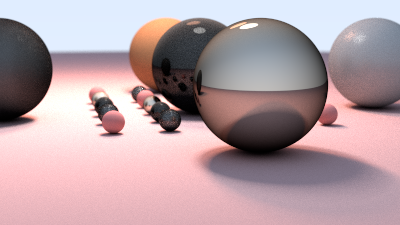

# 🎯 Path Tracing in Rust

A toy, high-quality path tracer written in safe, modern Rust — inspired by PBRT, `Ray Tracing in One Weekend`, and Autodesk Standard Surface.
Completely in a vibe coding mood.


---

## ✨ Features

- ✅ **Physically-Based Path Tracing**
  - Supports diffuse, metal, glass, Blinn-Phong, Cook-Torrance
- 🔁 **Recursive Ray Scattering** with depth control
- 💡 **Multiple Light Sources**
  - Emissive materials
  - Light sampling & MIS (Multiple Importance Sampling)
- ⚙️ **Material System**
  - Trait-based, easy to extend
  - Microfacet GGX BRDF with Fresnel and geometry terms
- 🧠 **Importance Sampling**
  - Supports BRDF- and light-based sampling
- ⚡ **Adaptive Sampling**
  - Early stop based on variance threshold
- 🧪 **Modular Design**
  - Clean separation between renderer, integrator, materials, scene

---

## 🚀 Getting Started

### 🔧 Build and Run

```bash
cargo run --release -- --samples-per-pixel 200 --max-depth 50
