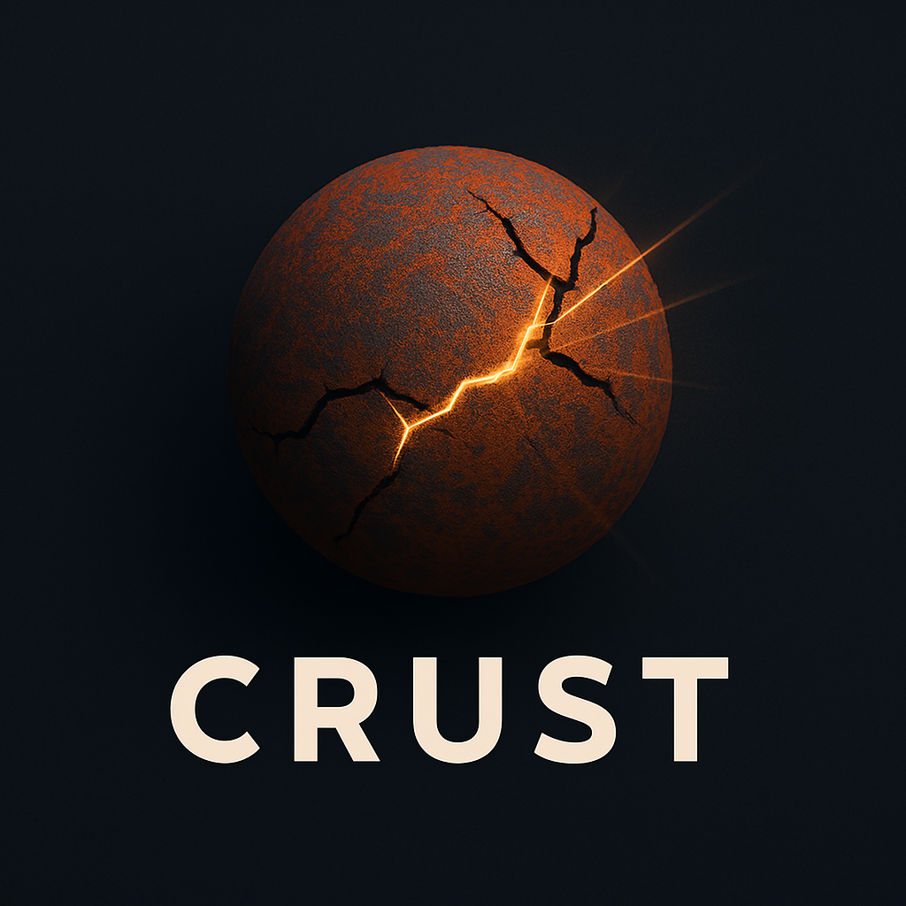
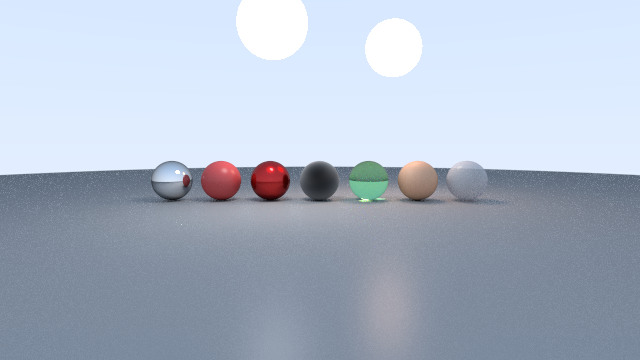

# Crust Render

<p align="center">
    
</p>

<br/>

A toy, high-quality path tracer written in safe, modern Rust — inspired by PBRT, `Ray Tracing in One Weekend`, and Autodesk Standard Surface.
Completely in a vibe coding mood.

## 📸 Preview



---

## ✨ Features

- ✅ **Physically-Based Path Tracing**
  - Supports diffuse, metal, glass, Blinn-Phong, Cook-Torrance
- 🔁 **Recursive Ray Scattering** with depth control
- 💡 **Multiple Light Sources**
  - Emissive materials
  - Light sampling & MIS (Multiple Importance Sampling)
- ⚙️ **Material System**
  - Trait-based, easy to extend
  - Microfacet GGX BRDF with Fresnel and geometry terms
- 🧠 **Importance Sampling**
  - Supports BRDF- and light-based sampling
- ⚡ **Adaptive Sampling**
  - Early stop based on variance threshold
- 🧪 **Modular Design**
  - Clean separation between renderer, integrator, materials, scene
- **Disney Principled Shader**
  - A basic integration of the animation standard shader
- **Correlated Multi-Jittered (CMJ)**
  - Use CMJ for camera and light rays

---

## 🚀 Getting Started

### 🔧 Build and Run

Scenes are loaded from **USD** (`.usda`, `.usdc`, `.usdz`) via the pure-Rust
[`openusd`](https://github.com/mxpv/openusd) crate. Camera, geometry, lights,
materials, and render settings all live in the USD stage.

```bash
# render a bundled sample
cargo run --release -- -i samples/openpbr_showcase.usda -o out.exr
cargo run --release -- -i samples/cornellbox.usda -o cornell.exr

# run with no scene → hard-coded procedural fallback
cargo run --release
```

### 🎨 Materials

Every `UsdGeomMesh` / `UsdGeomSphere` binds a `UsdShadeMaterial` via
`MaterialBindingAPI`. The bound `Shader` is resolved by its `info:id`:

- `info:id = "UsdPreviewSurface"` → mapped into OpenPBR
  (`diffuseColor → baseColor`, `metallic → baseMetalness`, `roughness → specularRoughness`,
  `opacity → geometryOpacity`, `emissiveColor → emissionColor`, `ior → specularIor`,
  `clearcoat → coatWeight`, `clearcoatRoughness → coatRoughness`). Portable across
  DCC apps.
- `info:id = "crust:openpbr"` → decodes the full OpenPBR surface 1:1. Every input
  is the camelCase mirror of the Rust field name (`baseColor`, `subsurfaceRadiusScale`,
  `geometryThinWalled`, …). Non-portable but lossless. See
  `samples/openpbr_showcase.usda` for the seven-preset reference scene.

Unbound geometry falls back to a grey Lambertian.

### 💡 Lights

`UsdLuxSphereLight` maps to an `Emissive` sphere that acts as both light and
visible geometry (matching classic Cornell-box scene semantics). Other lux
types (`RectLight`, `DiskLight`, `DistantLight`, `DomeLight`, `CylinderLight`)
warn once and are skipped — follow-up work.

### 🎥 Camera & render settings

`UsdGeomCamera` provides focalLength / horizontalAperture / verticalAperture /
fStop / focusDistance plus the ancestor Xform stack. `UsdRenderSettings` provides
`resolution`; per-render params live in the `crust:` namespace as custom attrs:

```
def RenderSettings "settings" {
    int2 resolution = (640, 360)
    int crust:samplesPerPixel = 128
    int crust:maxDepth = 32
    int crust:minSamplesPerPixel = 32
    float crust:varianceThreshold = 0.05
    int crust:frame = 0
}
```

Missing attrs fall back to sensible defaults (128 spp, 32 depth, 640×360).

### CLI

```bash
cargo run --release -- --samples-per-pixel 200 --max-depth 50
