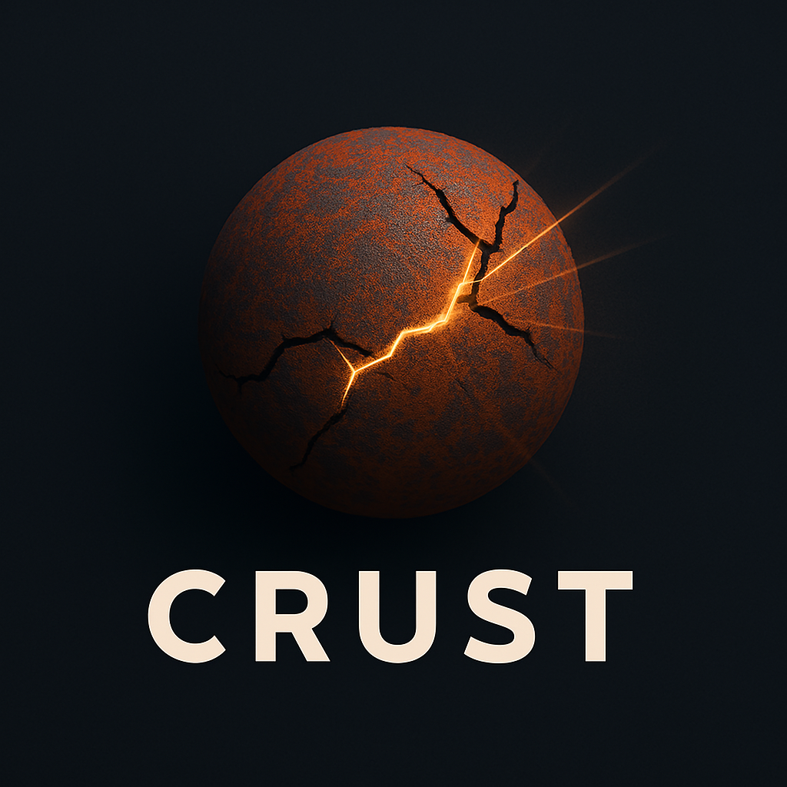
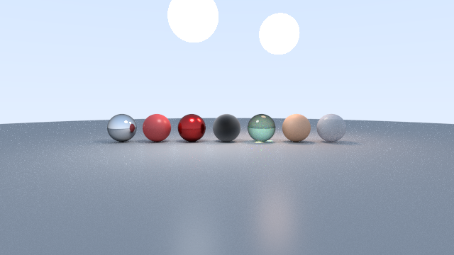
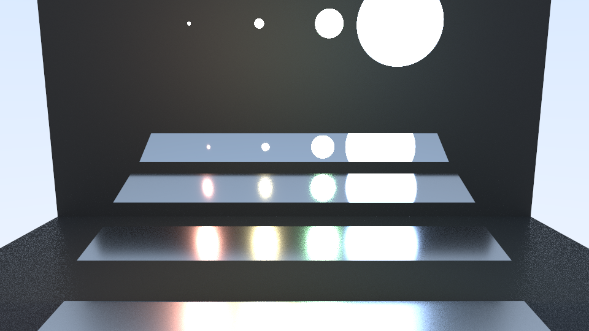
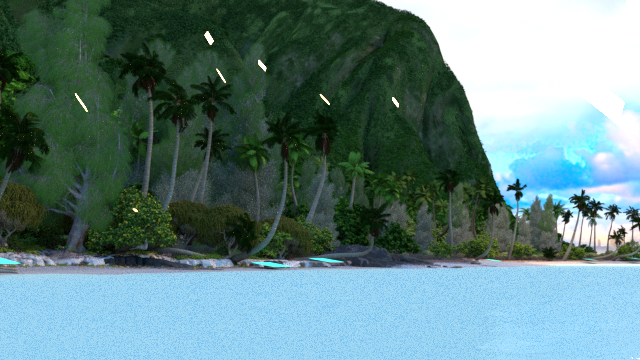

# Crust Render

<p align="center">
    
</p>

<br/>

A toy, high-quality path tracer written in safe, modern Rust — inspired by PBRT, `Ray Tracing in One Weekend`, and Autodesk Standard Surface.
Completely in a vibe coding mood.

## 📸 Preview



---

## ✨ Features

- ✅ **Physically-Based Path Tracing**
  - One material to rule them all: the OpenPBR übershader (diffuse, metal,
    glass, coat, fuzz, thin-film, subsurface, emission)
- 🔁 **Recursive Ray Scattering** with depth control
- 💡 **Multiple Light Sources**
  - Emissive materials
  - Light sampling & MIS (Multiple Importance Sampling) with selectable
    strategy: power / balance heuristic, or light-only / bsdf-only for
    diagnosis (`samples/veach_mis.usda` is the classic comparison scene)
- ⚙️ **Material System**
  - Trait-based (`Material`), with OpenPBR as the single surface shader
  - Microfacet GGX BRDF with Fresnel and geometry terms
  - Rust-side presets: `OpenPBR::diffuse / metal / glass / glossy`
- 🧠 **Importance Sampling**
  - Supports BRDF- and light-based sampling
- 🧭 **Path Guiding** (opt-in)
  - Pure-Rust Practical Path Guiding (SD-tree), one-sample MIS with the BSDF
- ⚡ **Adaptive Sampling**
  - Pixels stop early once their relative standard error drops below
    `crust:varianceThreshold` (after `crust:minSamplesPerPixel` samples)
- 🌫️ **Volume Rendering**
  - Free-standing smoke/fog/absorption/fire volume regions (homogeneous,
    procedural fBm noise, or an inline voxel grid), with NEE + MIS at
    scatter vertices and transmittance-aware shadow rays
- 🧪 **Modular Design**
  - Clean separation between renderer, integrator, materials, scene
- **Owen-Scrambled Sobol Sampling**
  - Per-pixel decorrelated low-discrepancy sampling (Burley 2020) for
    camera, light, and BSDF rays

---

## 🚀 Getting Started

### 🔧 Build and Run

Scenes are loaded from **USD** (`.usda`, `.usdc`, `.usdz`) via the pure-Rust
[`openusd`](https://github.com/mxpv/openusd) crate. Camera, geometry, lights,
materials, and render settings all live in the USD stage.

```bash
# render a bundled sample
cargo run --release -- -i samples/openpbr_showcase.usda -o out.exr
cargo run --release -- -i samples/cornellbox.usda -o cornell.exr

# run with no scene → hard-coded procedural fallback
cargo run --release
```

### 📐 Geometry & acceleration

All intersection lives in the **`crust-rt`** kernel crate, behind an
**Embree-shaped API** (`Geometry` → `SceneBuilder` → `commit()` →
`intersect`/`occluded`, ID-based hits — swappable for Embree bindings behind
the same seam, in 100 % safe Rust). Meshes triangulate with a **watertight**
ray/triangle test (Woop et al. 2013 — no pinholes along shared edges) and
build a **BVH4**: a parallel, deterministic, reference-based SAH build with
SBVH **spatial splits** (Stich et al. 2009), collapsed into 4-wide SIMD nodes
whose slab tests run on `Vec4` lanes. Shadow rays use a dedicated early-exit
**occlusion query** (the `rtcIntersect`/`rtcOccluded` split). Mesh geometry is
**instanced only when it is actually reused**: prims sharing
points/topology/material share one triangle BVH under an instance transform,
while geometry placed exactly once is baked into world space so its triangles
sit directly in the top-level BVH. Instancing a single placement buys no
sharing and costs every entering ray a transform plus a cold descent into a
second tree — dropping it took instance descents from 3.85 to 0.13 per camera
ray on `samples/cornellbox.usda`.
`UsdGeomBasisCurves` import as **round curve segments** (sphere-swept cones;
cubic bezier/bspline/catmullRom spans flatten to polylines) — see
`samples/curves.usda`. Two per-prim extras:

- `crust:motion:translate = (x, y, z)` — **transform motion blur**: the prim
  streaks through that world-space translation over the shutter
  (`samples/motionblur.usda`).
- `crust:rayMask = <int>` — **ray visibility mask** (bit 0 camera, bit 1
  shadow, bit 2 indirect): e.g. `6` is a shadow-caster hidden from the camera.

### 🎨 Materials

Every `UsdGeomMesh` / `UsdGeomSphere` binds a `UsdShadeMaterial` via
`MaterialBindingAPI`. The bound `Shader` is resolved by its `info:id`:

- `info:id = "UsdPreviewSurface"` → mapped into OpenPBR
  (`diffuseColor → baseColor`, `metallic → baseMetalness`, `roughness → specularRoughness`,
  `opacity → geometryOpacity`, `emissiveColor → emissionColor`, `ior → specularIor`,
  `clearcoat → coatWeight`, `clearcoatRoughness → coatRoughness`). Portable across
  DCC apps.
- `info:id = "crust:openpbr"` → decodes the full OpenPBR surface 1:1. Every input
  is the camelCase mirror of the Rust field name (`baseColor`, `subsurfaceRadiusScale`,
  `geometryThinWalled`, …). Non-portable but lossless. See
  `samples/openpbr_showcase.usda` for the seven-preset reference scene.

Unbound geometry falls back to a grey diffuse OpenPBR.

### 💡 Lights

`UsdLuxSphereLight` maps to an `Emissive` sphere that acts as both light and
visible geometry (matching classic Cornell-box scene semantics).
`UsdLuxRectLight` maps to two emissive triangles + an `AreaLight` (local XY
plane, emitting along -Z per UsdLux; effectively one-sided) — see
`samples/rectlight.usda`. Other lux types (`DiskLight`, `DistantLight`,
`DomeLight`, `CylinderLight`) warn once and are skipped — follow-up work.

### 🌫️ Volumes

Any prim carrying `crust:volume:type` imports as a free-standing
`VolumeRegion` — an oriented box, outside the surface BVH so it never
occludes shadow rays — with a `homogeneous`, `smoke` (procedural fBm noise),
or `grid` (inline voxel data) density field and its own σₛ/σₐ/anisotropy/
emission. Scatter vertices inside a region get NEE with MIS against the
phase function, and shadow rays attenuate through volumes via ratio/Beer-
Lambert transmittance. See `samples/fog.usda` (homogeneous god rays) and
`samples/smoke.usda` (noise plume + emissive ember + explicit grid).

### 🎥 Camera & render settings

`UsdGeomCamera` provides focalLength / horizontalAperture / verticalAperture /
fStop / focusDistance plus the ancestor Xform stack. `UsdRenderSettings` provides
`resolution`; per-render params live in the `crust:` namespace as custom attrs:

```
def RenderSettings "settings" {
    int2 resolution = (640, 360)
    int crust:samplesPerPixel = 128
    int crust:maxDepth = 32
    int crust:minSamplesPerPixel = 32
    float crust:varianceThreshold = 0.05
    int crust:frame = 0
    bool crust:pathGuiding = false
    int crust:guidingTrainIterations = 8
    float crust:guidingProb = 0.5
    token crust:samplingStrategy = "power"   # power | balance | light | bsdf
    token crust:pixelFilter = "triangle"     # box | triangle | gaussian | blackman | mitchell
    float crust:pixelFilterRadius = 1.0      # pixels from the pixel center
}
```

Missing attrs fall back to sensible defaults (128 spp, 32 depth, 640×360,
guiding off, triangle filter at radius 1).

The pixel filter reconstructs the image from the samples: `triangle` (the
default), `gaussian` and `blackman` trade a little sharpness for smoother
edges and less pixel-to-pixel noise, `mitchell` sharpens with negative
lobes (may ring next to hard contrast), and `box` at radius 0.5 is the
classic one-sample-per-pixel-footprint jitter — bit-identical to renders
from before filtering existed. Each filter has its own default radius
(box 0.5, triangle 1, gaussian/blackman 1.5, mitchell 2);
`crust:pixelFilterRadius` overrides it. Filtering is applied by filter
importance sampling — sample positions are drawn from the filter's own
distribution — so it costs nothing per sample and adaptive sampling keeps
working per pixel.

### 🧭 Path guiding

An opt-in, pure-Rust implementation of *Practical Path Guiding* (Müller et
al. 2017) — the SD-tree algorithm family that Intel's
[OpenPGL](https://github.com/OpenPathGuidingLibrary/openpgl) generalizes,
reimplemented natively so the renderer stays dependency-light and 100% safe
Rust. The renderer learns a spatio-directional distribution of incident
radiance (a binary spatial tree over the scene whose leaves hold adaptive
directional quadtrees) over progressive training passes with geometrically
growing budgets (1, 2, 4, … spp), then renders the final image by one-sample
MIS: each secondary bounce draws its direction from the learned distribution
with probability `crust:guidingProb` and from the BSDF otherwise, dividing by
the mixture pdf.

Enable it per scene with `bool crust:pathGuiding = true` on the
RenderSettings prim. `crust:guidingTrainIterations` controls how many
training passes run before the final pass (their total cost is
`2^iterations − 1` spp — not wasted: every pass is blended into the final
image weighted by inverse variance, so the training budget contributes at
equal total spp). Guiding pays off on scenes where light is hard to
find by chance — the bundled `samples/cornellbox_guided.usda` hides its only
light behind a shroud so all transport is multi-bounce, and guiding cuts MSE
against a converged reference by ~20% at equal final spp:

```bash
cargo run --release -- -i samples/cornellbox_guided.usda
```

Every continuous lobe is guided — including refraction: thick glass uses a
real Walter et al. 2007 microfacet BTDF with a proper VNDF-based pdf, so
the guiding field can learn and sample directions straight through it.
Dispersion is continuous too — each RGB channel refracts with its own IOR
(one channel's IOR sampled uniformly, three per-channel BTDF evaluations
with a channel-averaged mixture pdf), so dispersive glass joins the NEE and
guiding mixtures instead of being a hero-wavelength delta lobe. Only
thin-walled transmission (a genuinely singular lobe) and volume scattering
are excluded; untrained regions fall back to plain BSDF sampling, so the
estimator stays unbiased everywhere.

### 🎯 Multiple importance sampling

Direct lighting is estimated by two strategies at once — light sampling
(next-event estimation) and BSDF sampling — combined with a Veach MIS
heuristic. Neither strategy works everywhere: light sampling collapses on
near-mirror surfaces (the sampled direction almost never lands inside the
narrow lobe), BSDF sampling collapses on rough surfaces lit by small lights
(the sampled lobe almost never hits the light). MIS weights each sample by
how well its strategy could have produced it, so every regime stays clean.

`crust:samplingStrategy` (or the `--strategy` CLI override) selects how the
two sides combine:

- `power` — β=2 power-heuristic MIS, the default
- `balance` — balance-heuristic MIS
- `light` — light sampling only (NEE at full weight, bounce-hit emission
  dropped)
- `bsdf` — BSDF sampling only (no shadow rays, bounce-hit emission at full
  weight)

All four are unbiased; they differ only in variance. `light` and `bsdf`
exist to visualize what MIS balances between, after
[Veach's classic scene](https://blog.yiningkarlli.com/2015/02/multiple-importance-sampling.html):

```bash
# four glossy plates (roughness 0.01 → 0.25) × four sphere lights of equal
# power (radius 0.05 → 1.35) — render one strategy at a time and compare
cargo run --release -- -i samples/veach_mis.usda -o veach_light.exr --strategy light
cargo run --release -- -i samples/veach_mis.usda -o veach_bsdf.exr  --strategy bsdf
cargo run --release -- -i samples/veach_mis.usda -o veach_mis.exr   --strategy power
```

Light-only renders the rough plates cleanly but leaves the smooth plates'
reflections dark and firefly-ridden; bsdf-only is the exact mirror image;
MIS matches the cleaner of the two everywhere.



### Moana Benchmark



### CLI

```bash
cargo run --release -- -i scene.usda   # input USD scene (.usda/.usdc/.usdz)
    -o out.exr                         # output EXR (+ tone-mapped PNG next to it)
    -s 256                             # override samples per pixel
    --strategy power                   # power | balance | light | bsdf
    --filter gaussian                  # box | triangle | gaussian | blackman | mitchell
    --filter-radius 1.5                # filter radius in pixels
    -b                                 # bucket (16×16 tile) rendering
    -l debug                           # log level
```
