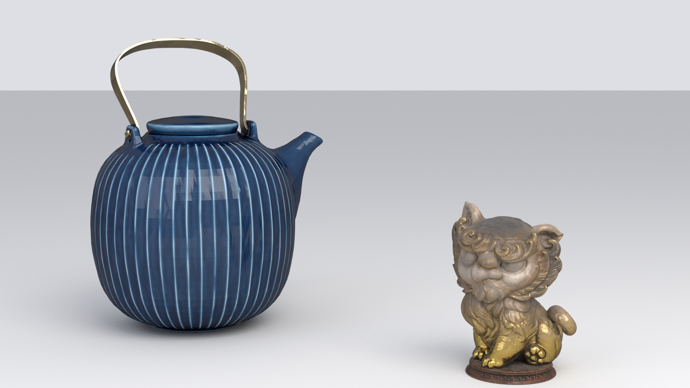

# Crust Render

<p align="center">
    
</p>

<br/>

A physically-based path tracer written in 100% safe Rust (edition 2024,
`forbid(unsafe_code)` on every crate but `crust-core`, which is `deny` so that one
test-only counting allocator — a `GlobalAlloc`, which cannot be implemented safely — can
opt out explicitly). It loads scenes directly from **USD** — including production-scale assets
such as Disney Animation's [Moana Island](#moana-benchmark) dataset — and implements its own
watertight ray/triangle kernel, SBVH acceleration structure, OpenPBR übershader, MaterialX
graph reader, volumetric integrator and Practical Path Guiding, with no dependency on Embree,
OpenPGL, or any existing renderer core. It is an independent, single-author project rather
than a production renderer: the architecture and formulas are informed by PBRT, *Ray Tracing
in One Weekend*, Autodesk Standard Surface / OpenPBR and the published Embree/OpenPGL papers,
but every kernel, material model and importer here is a from-scratch implementation, and the
[known limitations](#known-limitations) — no GPU path, no deformation motion blur, no OpenVDB
import — are documented rather than hidden. See `docs/embree_comparison.md` for a detailed,
feature-by-feature comparison against Embree's intersection kernels.

## 📸 Preview


---

## ✨ Features

- ✅ **Physically-Based Path Tracing**
  - One material to rule them all: the OpenPBR übershader (diffuse, metal,
    glass, coat, fuzz, thin-film, subsurface, emission)
- 🔁 **Recursive Ray Scattering** with depth control
- 💡 **Multiple Light Sources**
  - Emissive materials
  - Light sampling & MIS (Multiple Importance Sampling) with selectable
    strategy: power / balance heuristic, or light-only / bsdf-only for
    diagnosis (`samples/veach_mis.usda` is the classic comparison scene)
- ⚙️ **Material System**
  - Trait-based (`Material`), with OpenPBR as the single surface shader
  - Microfacet GGX BRDF with Fresnel and geometry terms
  - Rust-side presets: `OpenPBR::diffuse / metal / glass / glossy`
- 🧩 **MaterialX** (`.mtlx`) look-dev graphs, read directly — standalone BSDF
  nodes composed with `layer`/`mix`, textured through UV/**UDIM** image sets
  and tangent-space normal maps, reduced onto OpenPBR at every shading point
- 🧠 **Importance Sampling**
  - Supports BRDF- and light-based sampling
- 🧭 **Path Guiding** (opt-in)
  - Pure-Rust Practical Path Guiding (SD-tree), one-sample MIS with the BSDF
- ⚡ **Adaptive Sampling**
  - Pixels stop early once their relative standard error drops below
    `crust:varianceThreshold` (after `crust:minSamplesPerPixel` samples)
- 🌫️ **Volume Rendering**
  - Free-standing smoke/fog/absorption/fire volume regions (homogeneous,
    procedural fBm noise, or an inline voxel grid), with NEE + MIS at
    scatter vertices and transmittance-aware shadow rays
- 🧪 **Modular Design**
  - Clean separation between renderer, integrator, materials, scene
- **Owen-Scrambled Sobol Sampling**
  - Per-pixel decorrelated low-discrepancy sampling (Burley 2020) for
    camera, light, and BSDF rays

---

## 🚀 Getting Started

### 🔧 Build and Run

Scenes are loaded from **USD** (`.usda`, `.usdc`, `.usdz`) via the pure-Rust
[`openusd`](https://github.com/mxpv/openusd) crate. Camera, geometry, lights,
materials, and render settings all live in the USD stage.

```bash
# render a bundled sample
cargo run --release -- -i samples/openpbr_showcase.usda -o out.exr
cargo run --release -- -i samples/cornellbox.usda -o cornell.exr

# run with no scene → hard-coded procedural fallback
cargo run --release
```

### 📐 Geometry & acceleration

All intersection lives in the **`crust-rt`** kernel crate, behind an
**Embree-shaped API** (`Geometry` → `SceneBuilder` → `commit()` →
`intersect`/`occluded`, ID-based hits — swappable for Embree bindings behind
the same seam, in 100 % safe Rust). Meshes triangulate with a **watertight**
ray/triangle test (Woop et al. 2013 — no pinholes along shared edges) and
build a **BVH4**: a parallel, deterministic, reference-based SAH build with
SBVH **spatial splits** (Stich et al. 2009), collapsed into 4-wide SIMD nodes
whose slab tests run on `Vec4` lanes. Shadow rays use a dedicated early-exit
**occlusion query** (the `rtcIntersect`/`rtcOccluded` split). Mesh geometry is
**instanced only when it is actually reused**: prims sharing
points/topology/material share one triangle BVH under an instance transform,
while geometry placed exactly once is baked into world space so its triangles
sit directly in the top-level BVH. Instancing a single placement buys no
sharing and costs every entering ray a transform plus a cold descent into a
second tree — dropping it took instance descents from 3.85 to 0.13 per camera
ray on `samples/cornellbox.usda`.
`UsdGeomBasisCurves` import as **round curve segments** (sphere-swept cones;
cubic bezier/bspline/catmullRom spans flatten to polylines) — see
`samples/curves.usda`. Two per-prim extras:

- `crust:motion:translate = (x, y, z)` — **transform motion blur**: the prim
  streaks through that world-space translation over the shutter
  (`samples/motionblur.usda`).
- `crust:rayMask = <int>` — **ray visibility mask** (bit 0 camera, bit 1
  shadow, bit 2 indirect): e.g. `6` is a shadow-caster hidden from the camera.

### 🎨 Materials

Every `UsdGeomMesh` / `UsdGeomSphere` binds a `UsdShadeMaterial` via
`MaterialBindingAPI`. The bound `Shader` is resolved by its `info:id`:

- `info:id = "UsdPreviewSurface"` → mapped into OpenPBR
  (`diffuseColor → baseColor`, `metallic → baseMetalness`, `roughness → specularRoughness`,
  `opacity → geometryOpacity`, `emissiveColor → emissionColor`, `ior → specularIor`,
  `clearcoat → coatWeight`, `clearcoatRoughness → coatRoughness`). Portable across
  DCC apps.
- `info:id = "crust:openpbr"` → decodes the full OpenPBR surface 1:1. Every input
  is the camelCase mirror of the Rust field name (`baseColor`, `subsurfaceRadiusScale`,
  `geometryThinWalled`, …). Non-portable but lossless. See
  `samples/openpbr_showcase.usda` for the seven-preset reference scene.

Unbound geometry falls back to a grey diffuse OpenPBR.

### 🧩 MaterialX



*The two [DPEL MaterialX assets](https://www.aswf.io/blog/materialxteapotlion/)
from NVIDIA — Teapot and Lion — rendered from their shipped `.mtlx` graphs
(`samples/materialx_showcase.usda`).*

A `Material` prim can be nothing but a reference into a MaterialX document:

```
def Material "TeapotCeramic" (
    prepend references = @Looks/teapot_ceramic_ldX.mtlx@</MaterialX/Materials/surfacematerial_teapot_ceramic>
)
{
}
```

USD normally resolves that through a MaterialX file-format plugin, which the
pure-Rust `openusd` does not have — so the prim composes empty and would fall
back to grey. Crust reads the `.mtlx` itself, in the standalone **`crust-mtlx`**
crate (no renderer dependency, just an XML parser and `glam`):

- the document parses to a name-addressed node graph and is **compiled once**
  into a slot-indexed program — ~30 pattern node types (`image`,
  `tiledimage`, `normalmap`, `mix`, `remap`, `contrast`, `artistic_ior`, …) —
  that runs per shading point with no name lookups and no allocation;
- the BSDF half — standalone `oren_nayar_diffuse_bsdf` / `dielectric_bsdf` /
  `conductor_bsdf` / `sheen_bsdf` nodes glued with `layer` and `mix`, which is
  how production look-dev is authored — is **flattened into weighted lobes**
  at compile time and pooled onto OpenPBR's lobe stack at shading time, so
  sampling, MIS and energy compensation stay in the one übershader. A
  dielectric layered over another specular (a glaze over a satin glaze, a
  varnish over metal) becomes OpenPBR's **coat** — the second specular lobe —
  with its own roughness and IOR; only deeper stacks average;
- `image` nodes resolve through the `AssetLoader` seam to **UV/UDIM**
  textures (`primvars:st`, `<UDIM>` tile sets, per-input colour space from
  the graph's own `colorspace` attribute) with a tangent frame for normal
  maps; the host decoder in `crust-assets` caps tile resolution
  (`CRUST_TEX_MAX`, default 1024 — the teapot's ceramic alone is 2.7 GB at
  full resolution) and keeps a trilinear mip pyramid below that cap, selected
  per hit by the ray cone's footprint. `CRUST_TEX_STREAM=1` swaps that whole
  path for a **streaming tile cache** instead: textures pre-converted to a
  tiled, mip-mapped `.tx` (OIIO's format, read and written natively) are paged
  in a 64x64 tile at a time under a byte budget, so memory stops tracking the
  scene's texture footprint and the resolution cap stops being needed at all.
  A `.tx` is backed by a tiled TIFF for 8-bit sources and by a tiled,
  mip-mapped **OpenEXR** for float ones — the backing is picked by magic number
  rather than extension, and the choice follows the source's actual range, so
  an HDR texture keeps values above 1.0 that a `u8` tile would clip.

The shipped DPEL documents address UDIM sets as `Albedo.<UDIM>.png` — a bare
`<` inside an attribute value, which is not well-formed XML. MaterialX's own
reader tolerates it; crust escapes the token before parsing, since rejecting
the document would mean no material at all rather than a wrong path.

Samples: `samples/materialx_basic.usda` is a self-contained fixture (20 KiB
of textures, what the tests run against); `materialx_teapot.usda`,
`materialx_lion.usda` and `materialx_showcase.usda` are shot layers for the
DPEL assets, which are not checked in — download
[MaterialXTeapotLion](https://dpel.aswf.io/materialx-teapot-lion/) first.
`cargo run --release -p crust-render --example mtlx_shade -- file.mtlx` prints
the OpenPBR parameters a graph reduces to at a given `(u, v)` — the way to
check a MaterialX surface, since a wrong colour-space decode still renders as
a plausible surface.

### 💡 Lights

`UsdLuxSphereLight` maps to an `Emissive` sphere + an `AreaLight` over the
same surface. `UsdLuxRectLight` maps to two emissive triangles + an
`AreaLight` (local XY plane, emitting along -Z per UsdLux; effectively
one-sided) — see `samples/rectlight.usda`. Following the industry
convention (Arnold, RenderMan, Karma), a light's source geometry is
**invisible to camera rays by default** — park lights inside the frame
without them showing up — while shadow and indirect rays still see it, so
occlusion and reflections of lights are unchanged. Author
`custom bool crust:light:cameraVisible = 1` on the light prim to render
the source itself (the classic Cornell-box look), or author
`crust:rayMask` for full per-category control (it wins outright when
present). See `samples/light_visibility.usda` for all three spellings.
`UsdLuxDistantLight` and `UsdLuxDomeLight` import as infinite lights with
no scene geometry; `DiskLight` and `CylinderLight` warn once and are
skipped — follow-up work.

### 🌫️ Volumes

Any prim carrying `crust:volume:type` imports as a free-standing
`VolumeRegion` — an oriented box, outside the surface BVH so it never
occludes shadow rays — with a `homogeneous`, `smoke` (procedural fBm noise),
or `grid` (inline voxel data) density field and its own σₛ/σₐ/anisotropy/
emission. Scatter vertices inside a region get NEE with MIS against the
phase function, and shadow rays attenuate through volumes via ratio/Beer-
Lambert transmittance. See `samples/fog.usda` (homogeneous god rays) and
`samples/smoke.usda` (noise plume + emissive ember + explicit grid).

### 🎥 Camera & render settings

`UsdGeomCamera` provides focalLength / horizontalAperture / verticalAperture /
fStop / focusDistance plus the ancestor Xform stack. `UsdRenderSettings` provides
`resolution`; per-render params live in the `crust:` namespace as custom attrs:

```
def RenderSettings "settings" {
    int2 resolution = (640, 360)
    int crust:samplesPerPixel = 128
    int crust:maxDepth = 32
    int crust:minSamplesPerPixel = 32
    float crust:varianceThreshold = 0.05
    int crust:frame = 0
    bool crust:pathGuiding = false
    int crust:guidingTrainIterations = 8
    float crust:guidingProb = 0.5
    token crust:samplingStrategy = "power"   # power | balance | light | bsdf
    token crust:pixelFilter = "triangle"     # box | triangle | gaussian | blackman | mitchell
    float crust:pixelFilterRadius = 1.0      # pixels from the pixel center
}
```

Missing attrs fall back to sensible defaults (128 spp, 32 depth, 640×360,
guiding off, triangle filter at radius 1).

The pixel filter reconstructs the image from the samples: `triangle` (the
default), `gaussian` and `blackman` trade a little sharpness for smoother
edges and less pixel-to-pixel noise, `mitchell` sharpens with negative
lobes (may ring next to hard contrast), and `box` at radius 0.5 is the
classic one-sample-per-pixel-footprint jitter — bit-identical to renders
from before filtering existed. Each filter has its own default radius
(box 0.5, triangle 1, gaussian/blackman 1.5, mitchell 2);
`crust:pixelFilterRadius` overrides it. Filtering is applied by filter
importance sampling — sample positions are drawn from the filter's own
distribution — so it costs nothing per sample and adaptive sampling keeps
working per pixel.

### 🧭 Path guiding

An opt-in, pure-Rust implementation of *Practical Path Guiding* (Müller et
al. 2017) — the SD-tree algorithm family that Intel's
[OpenPGL](https://github.com/OpenPathGuidingLibrary/openpgl) generalizes,
reimplemented natively so the renderer stays dependency-light and 100% safe
Rust. The renderer learns a spatio-directional distribution of incident
radiance (a binary spatial tree over the scene whose leaves hold adaptive
directional quadtrees) over progressive training passes with geometrically
growing budgets (1, 2, 4, … spp), then renders the final image by one-sample
MIS: each secondary bounce draws its direction from the learned distribution
with probability `crust:guidingProb` and from the BSDF otherwise, dividing by
the mixture pdf.

Enable it per scene with `bool crust:pathGuiding = true` on the
RenderSettings prim. `crust:guidingTrainIterations` controls how many
training passes run before the final pass (their total cost is
`2^iterations − 1` spp — not wasted: every pass is blended into the final
image weighted by inverse variance, so the training budget contributes at
equal total spp). Guiding pays off on scenes where light is hard to
find by chance — the bundled `samples/cornellbox_guided.usda` hides its only
light behind a shroud so all transport is multi-bounce, and guiding cuts MSE
against a converged reference by ~20% at equal final spp:

```bash
cargo run --release -- -i samples/cornellbox_guided.usda
```

Every continuous lobe is guided — including refraction: thick glass uses a
real Walter et al. 2007 microfacet BTDF with a proper VNDF-based pdf, so
the guiding field can learn and sample directions straight through it.
Dispersion is continuous too — each RGB channel refracts with its own IOR
(one channel's IOR sampled uniformly, three per-channel BTDF evaluations
with a channel-averaged mixture pdf), so dispersive glass joins the NEE and
guiding mixtures instead of being a hero-wavelength delta lobe. Only
thin-walled transmission (a genuinely singular lobe) and volume scattering
are excluded; untrained regions fall back to plain BSDF sampling, so the
estimator stays unbiased everywhere.

### 🎯 Multiple importance sampling

Direct lighting is estimated by two strategies at once — light sampling
(next-event estimation) and BSDF sampling — combined with a Veach MIS
heuristic. Neither strategy works everywhere: light sampling collapses on
near-mirror surfaces (the sampled direction almost never lands inside the
narrow lobe), BSDF sampling collapses on rough surfaces lit by small lights
(the sampled lobe almost never hits the light). MIS weights each sample by
how well its strategy could have produced it, so every regime stays clean.

`crust:samplingStrategy` (or the `--strategy` CLI override) selects how the
two sides combine:

- `power` — β=2 power-heuristic MIS, the default
- `balance` — balance-heuristic MIS
- `light` — light sampling only (NEE at full weight, bounce-hit emission
  dropped)
- `bsdf` — BSDF sampling only (no shadow rays, bounce-hit emission at full
  weight)

All four are unbiased; they differ only in variance. `light` and `bsdf`
exist to visualize what MIS balances between, after
[Veach's classic scene](https://blog.yiningkarlli.com/2015/02/multiple-importance-sampling.html):

```bash
# four glossy plates (roughness 0.01 → 0.25) × four sphere lights of equal
# power (radius 0.05 → 1.35) — render one strategy at a time and compare
cargo run --release -- -i samples/veach_mis.usda -o veach_light.exr --strategy light
cargo run --release -- -i samples/veach_mis.usda -o veach_bsdf.exr  --strategy bsdf
cargo run --release -- -i samples/veach_mis.usda -o veach_mis.exr   --strategy power
```

Light-only renders the rough plates cleanly but leaves the smooth plates'
reflections dark and firefly-ridden; bsdf-only is the exact mirror image;
MIS matches the cleaner of the two everywhere.


### Moana Benchmark


Disney Animation's [Moana Island scene](https://www.disneyanimation.com/resources/moana-island-scene/)
is the industry's standard stress test for production renderers — 20 heavily-instanced
elements (foliage, ocean, terrain, dressed sets) totaling billions of triangles once
instances are expanded. Crust imports `usd/island.usda` directly, with no preprocessing,
flattening, or format conversion, and renders it end to end.

Measured numbers from that import (see `CLAUDE.md` for the full breakdown):

- **3,151,850** geometries composing to **21,904,388** top-level BVH primitives, importing
  in ~6m18s (of which ~4m45s is USD traversal) at a **~47.6 GiB** peak.
- **~57.7 M** unique top-level triangles across the 20 elements — the largest being the
  ocean (`osOcean`, 15.6 M), coral (`isCoral`, 14.5 M) and the two mountains (6.7 M / 6.4 M
  triangles) — with instancing (native `instanceable` prims and `PointInstancer`s, nested
  to arbitrary depth) reusing shared geometry rather than duplicating it, which is what
  keeps memory bounded on a dataset this size.
- A **streaming importer**: rather than composing the whole USD stage at once, the
  importer opens a cheap index stage, then composes and drops one masked stage per
  top-level subtree. This bounds peak composition to roughly one element at a time
  instead of the whole island — **117.10 GiB / 13:20 → 43.76 GiB / 09:19** measured on
  this scene, with pixel-identical output.
- **Ptex** per-face texturing over the island's 2,576,238 texture faces, mip-capped by
  default to keep memory tractable: **4.58 GiB** at the default 32×32 cap versus
  **494 GiB** if every face loaded at its authored full resolution. Each face carries a
  mip pyramid below that cap, so the cap is a memory ceiling rather than an accidental
  anti-aliaser — and can therefore come down: 16×16 plus a full pyramid is around
  2.45 GiB, under half the default, and filters better at distance.
- **Streaming Ptex**, which replaces that cap: the pyramid stays on disk and one tile of
  one level of one face is paged in behind a bounded cache, so memory scales with the
  cache rather than with the asset. Measured at 640×360 / 8 spp against the same build
  preloading: Ptex residency **5.98 → 0.61 GiB**, `Load assets` **01:40.7 → 27.3 s**,
  traverse-phase RSS **47.34 → 41.48 GiB**, peak RSS **51.28 → 47.08 GiB**, and `Render`
  costs **+1.2%** — the whole run finished 69 s sooner. It is opt-in, and on this scene
  it takes **two** environment variables rather than one:

  ```bash
  CRUST_PTEX_STREAM=1 CRUST_PTEX_STREAM_MIPSPACE=file CRUST_PTEX_CACHE_MB=2048 \
      cargo run --release -- -i usd/island.usda --stats
  ```

  `CRUST_PTEX_STREAM_MIPSPACE=file` is the one that is easy to miss, and without it
  nothing streams. A `.ptx`'s stored mip levels were reduced in the file's own display
  encoding, while the preloaded pyramid is reduced in linear light — the same mismatch
  `crust:mipspace` refuses for streamed UV textures, and refused here for the same
  reason: level 0 stays perfectly correct and only minification is wrong, so it reads as
  a filtering bug rather than a colour one. So a mipmapped `.ptx` is declined and
  preloaded by default, which on the island means all of them. `=file` accepts the
  file's chain (darker under minification, up to 0.147 on the tiled test fixture) and the
  residency above; `--stats` prints which backend actually ran either way. See
  `docs/ptex_streaming.md`.
- Two `UsdLuxDomeLight` environment textures authored on the stage (a modeling choice
  in the source asset, not a crust limitation) currently both decode and both light the
  scene, peaking at ~11 GiB for that pair alone — the first lever to pull if memory is
  tight is disabling the inactive one (`sky_dome_cam_llc`).

This is a correctness and scalability benchmark, not a performance claim: the point is
that a hand-written, dependency-light Rust importer and renderer can open, resolve
material bindings and instancing for, and render a real production dataset of this size
without special-casing it.

### CLI

```bash
cargo run --release -- -i scene.usda   # input USD scene (.usda/.usdc/.usdz)
    -o out.exr                         # output EXR (+ tone-mapped PNG next to it)
    -s 256                             # override samples per pixel
    --strategy power                   # power | balance | light | bsdf
    --filter gaussian                  # box | triangle | gaussian | blackman | mitchell
    --filter-radius 1.5                # filter radius in pixels
    -b                                 # bucket (16×16 tile) rendering
    -l debug                           # log level
```

### Known limitations

Documented gaps rather than silent ones — see `CLAUDE.md`'s "Known incomplete work" for
the full, per-feature detail and workarounds:

- **No GPU path.** Everything runs on the CPU, parallelized with Rayon; there is no
  wavefront/GPU renderer and no coherent ray-packet traversal.
- **SIMD stops at 128 bits.** BVH traversal and triangle packets use SSE2/NEON-width
  vectors (`glam`); reaching AVX2/AVX-512 in safe, portable Rust would need
  `std::simd` (nightly-only) or `unsafe` intrinsics, so it is deliberately not done.
- **Motion blur is transform-only.** Linear matrix lerp per instance; no deformation
  (per-vertex) blur and no quaternion-correct rotation blur.
- **No OpenVDB / `UsdVolVolume` import.** Volumes are homogeneous, procedural noise, or
  an inline voxel grid authored directly in USD.
- **Texture filtering is isotropic.** Minification is filtered — ray cones give each hit
  a footprint, and both the UV and Ptex paths read trilinear mip pyramids from it — but
  the filter has no direction, so a chart stretched in one axis over-blurs at grazing
  angles where an EWA or ripmap filter would not. Cone spread also ignores surface
  curvature and the lens aperture.
- **Streamed Ptex cannot build its mip chain in linear light.** Ptex streams now —
  [`ptex-rs`](https://github.com/doubleailes/ptex-rs) grew the `PtexCache` equivalent this
  needed, so the cache is the reader's rather than a second one here — but a level read
  off disk was reduced in the file's own encoding, where the preloaded pyramid is reduced
  in linear light. That is refused rather than shipped quietly, so a mipmapped `.ptx`
  preloads unless `CRUST_PTEX_STREAM_MIPSPACE=file` opts into the file's chain (see the
  Moana section above). Retiring the gate needs the reduction to happen in the reader
  against a declared working space; doing it here would mean a second pyramid cache *and*
  a full-resolution read to answer a coarse lookup.
- **An HDR texture's range stops at the shader.** A streamed `.tx` with an EXR backing
  carries values above 1.0 intact, but the only textured input crust has is base colour,
  and an albedo above 1 creates energy — the diffuse lobe clamps it, correctly. The
  input that *would* use the range is emission, and no MaterialX EDF node is implemented,
  so a graph cannot drive it from an image. That, rather than the file format, is what
  HDR textures are waiting on.
- **MaterialX layering caps at two stacked specular interfaces**; a third dielectric
  layer is averaged into the coat rather than kept distinct, and MaterialX transmission
  nodes have no glass lobe equivalent yet.
- **Path guiding covers surfaces only** — no volume/phase-function guiding, and it
  trains on luminance rather than a chromatic distribution.
- Some USD light types (`DiskLight`, `CylinderLight`) and material inputs
  (`subsurface*`/`specularTint` on `PxrDisneyBsdf`) are read and warned about rather
  than mapped.
