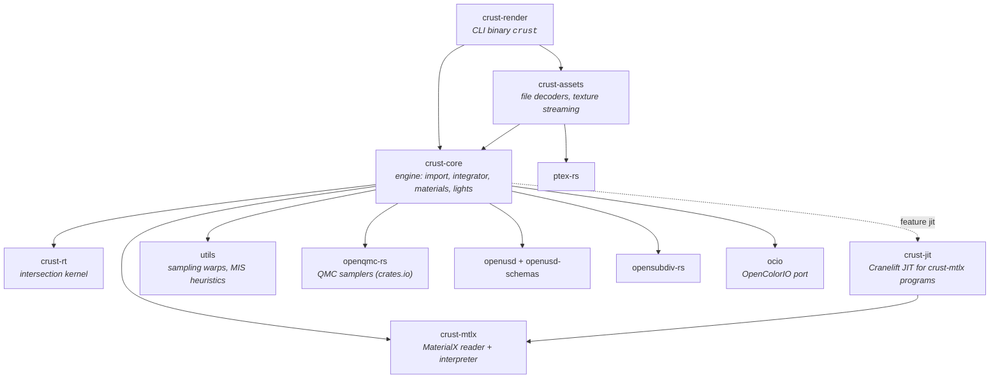

# Architecture

This document is the map: which crate owns what, how a render flows through
them, where the extension seams are, and which invariants cross module
boundaries. It deliberately stays short on *why* a given algorithm was chosen —
that reasoning, with its measurements, lives beside the code, in the
per-capability design records (`openspec/specs/*/design.md`) and in the topic
documents listed at the end. `CLAUDE.md` is the short contributor guide; this is
the page to read first.

## Crates



| crate | owns | knows nothing about |
|-------|------|---------------------|
| `crust-rt` | geometry, SBVH build → BVH4, `intersect` / `occluded`, instancing, motion blur | materials, lights, USD |
| `crust-mtlx` | `.mtlx` parsing, graph → slot-indexed `Program`, the BSDF closure tree and EDF terms, surface-shader nodes expanded into their nodegraphs | crust types (it defines the `Texture` trait it consumes) |
| `crust-jit` | compiling a `Program` to machine code, bit-identical to the interpreter | everything but `crust-mtlx` |
| `crust-core` | USD import, `Scene`, `Renderer`, integrator, materials, lights, volumes, guiding, colour management (the OCIO config, every transfer curve), stats/profile, the diagnostic (`diagnostic/`: phases, trials, the `crust-diagnostic/1` report and its Markdown) | image, texture and IES decoding; UI |
| `crust-assets` | every file decoder (EXR, PNG/HDR, Ptex, IES, `.tx`), the tile caches, `maketx` | the integrator |
| `crust-render` | argument parsing, logging, progress bar, writing EXR + PNG, printing and saving the diagnostic's report | decoding anything |
| `utils` | stateless math: warps, `power_heuristic`, `luminance` / `Luma`, `align_to_normal` | everything |

Two properties of this graph are deliberate and worth keeping:

- **`crust-core` decodes no assets.** It parses USD itself (through `openusd`),
  but every byte read from an image, Ptex or IES file crosses the
  `AssetLoader` seam (below) into `crust-assets`. That is why the
  engine library has no codec dependencies and why the probe examples in
  `crust-render/examples/` decode exactly the way the renderer does.
- **The two leaf libraries have no crust dependency.** `crust-rt` and
  `crust-mtlx` are shaped to be extracted the way `openqmc-rs` already was.
  `crust-core` adopts their vocabulary (`crust_rt::Geometry`,
  `crust_mtlx::Texture` re-exported as `Texture2D`) instead of wrapping it in
  adapter traits: a wrapper would add a vtable hop per texel fetch that LTO
  cannot remove.

## A render, end to end

```
crust-render::main → render  (`crust render`; `crust ls <kind>` is Scene::list_usd;
                              `crust diagnostic` imports the same way, then diagnostic::run)
 ├─ FileAssets::new()                        crust-assets: residency policy from CRUST_* env
 ├─ Scene::from_usd_with_options(path, &assets, opts)
 │   └─ scene::usd_import::load_scene        crust-core
 │       ├─ index stage (payloads unloaded) → RenderSettings, RenderProducts (AovRequest), camera choice, chunk list
 │       ├─ for each chunk: open masked stage → traverse_into → drop stage
 │       │     prims dispatch to mesh / shapes / instancing / lights / volume / camera
 │       │     materials resolve through materials::resolve_material (cached per stage epoch)
 │       │     assets decode through AssetLoader (timed as "Load assets")
 │       ├─ mesh::flush_meshes               bake-once vs instance, now that counts are final
 │       └─ WorldBuilder::commit             top-level SBVH (crust-rt)
 ├─ Renderer::new(scene)                     light selection table, optional learned light cache
 ├─ Renderer::render_with_stats(tiled, progress)     no products
 │  or Renderer::render_with_aovs(…, &scene.aovs)    products: + AovFilm
 │   └─ per tile → per pixel → per sample: advance_pixel → trace_path
 │         forward walk: intersect, resolve material (ShadingPoint), NEE, scatter
 │         backward gather: MIS-weighted radiance, guiding training samples
 │         AOV instantiation only: the first hit → the unit's AOV planes
 └─ write EXR (linear) + PNG (tone-mapped) — crust-render only
       no products: write_rgb_file at -o; products: one scanline EXR each (main.rs, products.rs)
```

Path guiding (`render_guided`) and adaptive sampling wrap the same per-pixel
routine; a render mode is scheduling only, and tiles vs scanlines are
bit-identical by construction. The adaptive (final) pass runs in rounds (batches
that grow 25% a round, `max(4, taken / 4)`, capped at the budget) over a
region-sized convergence-index buffer, so a pixel stops only
when its cross neighbours are not much less converged than it is
(`crust:adaptiveNeighbourTolerance`, default 1, negative to compare nothing);
a pixel that has seen no light never stops early, and the minimum is floored
at `⌈√spp⌉` — see `openspec/specs/rendering/design.md` § Adaptive sampling.
A render region (`RenderSettings::region`, from `dataWindowNDC` or `--region`)
is scheduling too: the tiles are the frame's grid clipped to it, every per-pixel
plane is region-sized and indexed by `PixelRect::index`, and the camera and
sampling keys stay the full frame's (§ Render regions there).

## Seams

These are the traits and types other code plugs into. Each has a contract that
both sides must keep; the contract lives in the doc comment at the definition.

| seam | defined in | implemented by | contract in one line |
|------|-----------|----------------|----------------------|
| `crust_rt::Geometry`, `SceneBuilder`, `Scene` | `crust-rt/src/scene/` | the kernel | Embree-shaped: attach, `commit()`, `intersect` / `occluded`; hits are `(geom_id, prim_id)` only |
| `WorldBuilder` / `World` | `crust-core/src/rt_world.rs` | — | pairs each `geom_id` with its material and per-triangle side tables (Ptex faces, UVs, density) |
| `AssetLoader` | `crust-core/src/scene.rs` | `crust_assets::FileAssets`, `NoAssets` | the host decodes; returning `None` means "fall back", never an error |
| `Texture2D` (= `crust_mtlx::Texture`), `PtexTexture` | `crust-mtlx/src/texture.rs`, `crust-core/src/texture.rs` | `UvTexture`, `StreamingTexture`, `PtexColor`, `PtexStream` | linear values out; unwrapped UVs in (UDIM addressing is the host's) |
| `Material` | `crust-core/src/material/material.rs` | `OpenPBR`, `Emissive`, `MtlxMaterial`, `PreviewSurface` | `resolve` once per vertex → `ShadingPoint`; `eval` returning `None` must not depend on `wi` |
| `Light`, `LightShape` | `crust-core/src/light/` (`mod.rs`, `shape.rs`) | `AreaLight`, `DistantLight`, `DomeLight`; sphere / rect / affine shapes | NEE and the bounce side must compute the same density for the same point |
| `ProgressCallback` | `crust-core/src/tracer/mod.rs` | the CLI's `indicatif` bar | called with `(done, total)`; the engine never prints |
| `RenderStats`, `profile::Section` | `crust-core/src/stats.rs`, `profile.rs` | — | counters always on, timers per phase; `--profile` sections compile away when off |

## `crust-core` module map

| area | modules |
|------|---------|
| scene description | `scene.rs` (`Scene`, `AssetLoader`, `UsdImportOptions`), `camera.rs`, `world.rs` (procedural fallback scene) |
| USD import | `scene/usd_import/` — module map in its `mod.rs`; `scene/subdiv/` (OpenSubdiv refinement: `uniform`, per-face `adaptive`, `topology`, `normals`); `scene/displace.rs` (scalar displacement of tessellated meshes, once per distinct mesh) |
| geometry bridge | `rt_world.rs` (`World`, side tables), `hittable.rs` (`HitRecord`), `ray.rs` (`Ray`, `RayCone`, ray masks), `aabb.rs` (re-export of the kernel's) |
| AOVs | `aov.rs` (the source vocabulary, `AovRequest`, the per-unit planes and the full-frame `AovFilm`); products resolved in `scene/usd_import/products.rs`; `lpe/` (OSL light path expressions: parser, one DFA per render); `tracer/route.rs` (routing a path's light into the expressions, and the albedo) |
| integrator | `tracer/` — `mod.rs` (`Renderer`: passes, tiles, guiding schedule), `path.rs` (`trace_path`, NEE, MIS weights, QMC domain keys), `settings.rs` (`RenderSettings`, `SamplingStrategy`); `filter.rs` (pixel filter importance sampling), `buffer.rs` |
| materials | `material/openpbr/` (the übershader: `mod.rs` parameters + `Material` impl, `lobes.rs`, `transmission.rs`), `brdf.rs` (shared lobes), `materialx.rs` (MaterialX `Material` + import), `closure/` (MaterialX closure-tree evaluation, BSDL / MaterialX tables), `preview_surface.rs`, `displacement.rs` (`Displacement`, resolved beside the material and consumed at import), `emissive.rs`, `material.rs` (trait + `ShadingPoint`) |
| lights | `light/` (`shape.rs` and `rect.rs` surfaces, `area.rs`, `infinite.rs` distant + dome, `list.rs` `LightList` and selection), `light_cache.rs` (learned selection), `lux.rs` (UsdLux units, shaping, IES), `environment.rs` (dome map importance sampling) |
| media | `medium.rs` (carried media: glass/subsurface interiors), `volume.rs` (free-standing volume regions), `subsurface.rs` (MaterialX `subsurface_bsdf` random walk: Chiang remap, channel MIS, Dwivedi guiding, the exit Lambertian) |
| guiding | `guiding/` — `sdtree.rs`, `dtree.rs`, `field.rs` (Practical Path Guiding) |
| textures | `texture.rs` (`ColorSpace`, texture refs, `PtexTexture`), `color.rs` (the OpenColorIO config, every transfer curve, the preview encode — `docs/color_management.md`) |
| reporting | `stats.rs` (`--stats`, and `--stats-json`'s `crust-stats/1`), `profile.rs` (`--profile`), `report.rs` (the JSON reports' envelope and value rules), `stamp.rs` (the `crust:*` sampling stamp every EXR carries), `compare.rs` (`crust diff`: identity, metrics, comparability, over decoded planes), `error.rs` |
| diagnostic | `diagnostic/` — `mod.rs` (`run`: calibration, baseline, crops, tiers 1–3, suggestions), `report.rs` (`Report`, the `crust-diagnostic/1` JSON), `markdown.rs`, `noise.rs` (the light path rows, light groups, tier-1 ordering rules, the brightest pixels' share), `crops.rs`, `schedule.rs` (budget, trial spp and the later tiers' reserves), `trials.rs` (the picture check, trimmed MRSE, the noise floor, ΔEff and at the target, verdicts, the per-crop reference), `checks.rs` (findings, picture ones included), `compare.rs` (`--baseline` deltas). It renders through `Renderer::render_measured` (`tracer/mod.rs`: `Instruments` → `Measured`), the only caller of the per-tile timer and the clamp counter |

## Invariants that span modules

Most bugs this codebase has had were one half of a pair changing without the
other. The pairs:

- **`Renderer::new` ↔ `Renderer::reconfigure`.** `new` is `reconfigure` on a
  fresh renderer, and `reconfigure` rebuilds everything that depends on the
  settings (the light selection, the `learned` pre-pass); every other setting
  is read per pass. A setting cached at construction must be rebuilt there too,
  or the diagnostic's trials measure the wrong renderer —
  `reconfigure_renders_what_new_renders` pins every varied setting bitwise.
- **The clamp and its counter.** The clamp counter (`PathContext::measure_clamp`)
  returns the *unclamped* radiance through a copy of the ordinary expression
  inside the clamp's own branch, and only in the `PROFILE` instantiation. Change
  the ordinary expression and change the copy: `the_clamp_counter_measures_what_the_clamp_removes`
  pins the image bitwise and the measured energy against a clamped render.
- **MIS weights.** Every NEE weight has a bounce-side twin
  (`bounce_emission_weight`, `escaped_emission`), and both go through
  `SamplingStrategy` and `LightList::density` / the `*_at` lookups. Surface
  NEE ↔ BSDF bounce, volume NEE ↔ `PrevVertex::Phase`, guided mixture pdf ↔ NEE.
  `LightList::density` takes the vertex's light sample count (`crust:lightSamples`
  / `crust:lightSamplesIndirect`): NEE both weights with and divides by
  `count · density` (the division is the average over the samples — do not
  divide by the count again), and the bounce side weights with the count
  `PrevVertex` carries from the vertex it left.
- **Hidden light sources.** A source the camera does not see is invisible to
  shadow rays (`light_ray_mask`) *and* crossed by bounce rays, which collect its
  emission and continue (`World::is_transparent_emitter`, `pass_cutouts`,
  `collect_crossings`). Change one side alone and NEE counts a light another
  hides while the bounce stops at the nearer one: biased MIS. The crossing's
  weight is `bounce_emission_weight_at`, its `L` event `Route::cross`.
- **The render camera ↔ `ls`'s `is_render_camera`.** Which camera a render goes
  through (`settings::wanted_camera`, then `pick_camera`'s fallback to the first
  camera the import's walk meets) is decided by the same two functions for the
  import and the listing, and the listing walks cameras a second time in the
  import's order to find that first one. Change the import's walk order and
  `the_render_camera_is_the_one_the_import_uses` (`tests/usd_listing.rs`) fails.
- **Light radiance.** `Emissive::radiance_toward` is the one answer to "what
  does this light emit toward here", read by `AreaLight::sample_li` and by
  `Material::emitted_at`.
- **Pass-throughs (cutouts and thin walls).** A hit a path passes through
  (`pass_cutouts` / `pass_walls`: probability `q = max P`, weight `P / q`, else
  a meet weighted `α / (1 − q)` on the BSDF without its straight lobe) and a
  shadow ray's `Π P` (`cutout_through` / `walls_through`, behind
  `shadow_transmittance` and the light cache's training) are one visibility,
  with `P = (1 − α) + α·T` — `α` the opacity, `T` the thin wall's straight
  transmittance (`ShadingPoint::straight_transmittance`), so `1 − opacity` at a
  cutout. Both ask `Material::opacity` and `T` point-sampled, both follow at
  most 256 crossings, both are gated on `World::has_pass_throughs`, and both
  cross each surface once (`LastCrossing`: a hit on the same
  `(geom_id, prim_id, placement)` from the same side within 1e-3·t of the
  crossing just made is the kernel's rounding, not a surface); change one and
  NEE and the bounce side disagree. The met wall's lobe set without `T`
  (`ShadingPoint::exclude_straight`) must renormalise its sampling and `eval`'s
  pdf together.
- **Medium boundaries.** A path crossing a volume-only material (the main
  loop's boundary branch, `pass_boundaries`) and a shadow ray crossing one
  (`through_boundaries`, behind `medium_shadow` and, unattenuated, the light
  cache's `surface_visibility`) change medium through the one
  `cross_boundary`, and both are gated on `World::has_medium_boundaries`; a scatter inside an
  `Enclosure` runs `volume_nee` and leaves `PrevVertex::Phase`, the pair a
  region scatter keeps. Change one side and NEE and the bounce side see
  different media.
- **Kernel bit-identity.** `Tri4` packets ↔ the scalar triangle test;
  indexed `Tri4i` packets ↔ gathered `Tri4` (`tri4i_matches_tri4_bitwise`,
  `packet_layouts_are_bit_identical`); JIT ↔ interpreter; streamed ↔
  preloaded `u8` textures; tiles ↔ scanlines; a region's pixels ↔ the same
  pixels of the full frame (with no neighbour hold). Each is pinned by a test that
  compares bits, not tolerances.
- **Derived, not stored.** A hit's tangent (`tangent_of`) and a subdivided
  mesh's Ptex sub-face corners (`SubFace::corners`) are computed from the
  kernel's shared vertices and a 4-byte cell at the hit; the tests that pin
  them against the tables they replaced must keep passing if either formula
  moves.
- **Import cache keys.** Anything keyed on a prototype path is scoped by the
  stage epoch (`ImportCaches::epoch`), because `/__Prototype_N` is renumbered
  per masked stage.
- **Stage listing.** `crust ls` (`Scene::list_usd`, `usd_import/listing.rs`)
  walks the stage apart from `traverse_into`, and must meet exactly the
  cameras and lights it meets: the same chunks, `prune_reason` (invisible
  subtrees walked for cameras only), instances and `PointInstancer`s not
  entered. A light type the import learns must join `listing::is_kind`.
  Pinned by `list_usd_lists_what_a_render_uses`, which renders through every
  camera listed and counts the lights against the import's light list.
- **Colour spaces.** Every colour input states its space; the per-input
  inventory is `docs/color_management.md`. Every curve is the OCIO config's
  (`crust-core/src/color.rs`). Every heuristic weighs a colour by the working
  space's luminance weights (`utils::Luma`, from `color::luma`), carried by
  value with the scene — `LightList::luma`, `OpenPBR::luma`, MaterialX
  `load_in`, `EnvironmentMap::new_in` — never a global; `Luma::REC709` must
  equal the config's luma coefficients
  (`utils_luminance_uses_the_config_luma_coefficients`) so a `lin_rec709`
  render is bit-identical.
- **AOVs observe; they never steer.** `trace_path::<_, AOV>` and
  `advance_pixel::<_, AOV>` must return the same radiance and take the same
  draws with `AOV` on and off (`the_beauty_is_bit_identical_with_and_without_aovs`),
  and the `AOV = false` instantiations are the code the beauty-only render
  always ran — pinned by callgrind's instruction count on cornellbox, not by a
  test. A filtered AOV uses exactly the beauty's per-sample weight `wx·wy` and
  its `weight_sum` (with the same `/ taken` fallback in `AovFilm::store`), and
  a guided render's AOVs blend with the beauty's own pass weights
  (`blend_weights`); change either side alone and an AOV stops matching the
  image it was rendered with. AOV planes are per pixel, in the pixel's own
  sample order, so tiles ↔ scanlines stays bit-identical for every channel.
- **Light path expressions route the beauty, not a copy of it.** The AOV
  gather (`tracer/route.rs`) re-evaluates the beauty's backward recurrence
  per expression and reuses its totals wherever the lobes agree for that
  expression, so `C.*[LO]` is the beauty bit for bit
  (`the_full_path_expression_is_the_beauty_bitwise`). Three pairs keep that
  true: `eval_all` ↔ `eval_split` (OpenPBR's per-lobe summands, pinned to
  rounding by `the_lobe_split_sums_to_eval_within_rounding`) and the closure's
  `eval_pdf` ↔ `eval_lobes` (pinned bitwise); `scatter_resolved` ↔
  `scatter_split`, one generic `scatter_with` so the split is taken at the
  *local* direction drawn (a world round trip moves a zero-roughness lobe's
  value by 0.2%); `escaped_emission` ↔ `escaped_split` (asserted bitwise in
  debug builds). The indirect clamp's factor is the beauty's, applied to
  every expression's continuation.
- **Products ↔ settings.** The render's camera, resolution and motion-blur
  switch (`disableMotionBlur` / `instantaneousShutter`) are the first
  `RenderProduct`'s (`import_render_products`), applied before the camera is
  imported; a product that differs is refused rather than resampled.
- **Motion blur ↔ the motion-vector AOV.** The `motionvector` AOV reads the
  same `transform_end` the kernel interpolates: `WorldBuilder` derives a
  per-`geom_id` translation from every `Geometry::Instance` it is given
  (`MotionRecord::of`, read back by `World::motion`), so the importer never
  states a prim's motion twice and the vector cannot fall out of step with the
  blur. A producer of a new kind of motion (a rotating end transform, nested
  motion, an id a forwarding `InstanceHitId::As` / `Offset` instance reports
  its inner hits under) gets a vector of zero and one summarised `WARN` at
  commit, not a silently wrong one; extend `MotionRecord` rather than adding
  a second table.
  `disableMotionBlur` gates only the shutter draw (`Renderer::shutter`, decided
  once per pass in `PassConfig`),
  never the records, so the vector is the same with blur on and off
  (`sample_value` rebases the hit to shutter open by the sample's `time`).

## Environment switches

Every switch exists to A/B one optimization against the behaviour it
replaced; with the switch set, the result is either bit-identical or the
documented alternative.

All of them are parsed once, in `crust-core/src/config.rs`, into the typed
`Config` that `crust_core::config()` returns (the "owner" column is the code
that obeys the field). Booleans share one grammar: `0`/`false`/`off`/`no` is
off, `1`/`true`/`on`/`yes` is on, and anything else warns once and keeps the
default. (Before the typed layer only the exact string `0` turned a default-on
switch off, and only `1` turned `CRUST_PTEX_STREAM` on; the other spellings
are the one behaviour change.) Numbers are validated by their type and warn
once on a bad value — `CRUST_TEX_MAX` used to fall back silently. A test or
probe that needs another setting builds a `Config` and passes it
(`FileAssets::with_config`) instead of mutating the environment.

| variable | default | owner | effect |
|----------|---------|-------|--------|
| `CRUST_STREAM_IMPORT` | on | `usd_import/mod.rs` | `0`: import under one stage instead of one masked stage per subtree |
| `CRUST_MESH_BAKE` | on | `usd_import/mesh.rs` | `0`: instance every mesh instead of baking single placements (not bit-identical: an instanced mesh is intersected in local space, so ~0.2% of cornellbox's pixels differ in the last ulp at 16 spp, relmse 4e-18) |
| `CRUST_SUBDIV` | on | `usd_import/attrs.rs` | `0`: render every mesh as its faceted cage (unlike `--subdiv-level 0`, no smooth cage normals) |
| `CRUST_DISPLACE` | on | `usd_import/materials.rs` | `0`: no material yields a displacement — every mesh imports undisplaced, a `none` mesh as its faceted cage (bit-identical to the stage with its displacement inputs removed) |
| `CRUST_ADAPTIVE_PER_FACE` | on | `usd_import/mesh.rs` (`mesh_source`) | In adaptive subdivision only. `0`: refine each unshared subdivision mesh to one level instead of tessellating it per face at its edges' own rates |
| `CRUST_ADAPTIVE_FRUSTUM` | on | `usd_import/adaptive.rs` (`Frustum`) | In adaptive subdivision only. `0`: rate geometry outside the camera's view by distance like the rest, instead of splitting each of its edges once |
| `CRUST_TRI_PACKETS` | `auto` (= `gathered`) | `lib.rs` (`commit_options`) → every kernel `commit` | `gathered`: 192-byte vertex-carrying packets (the layout before indexed packets); `indexed`: 92-byte index packets, a quarter fewer kernel bytes per triangle for 13–30% slower traversal (8–9% on the Moana island at level 1, where a 3–4% faster import makes the whole run faster) — the opt-in for a scene that otherwise does not fit. Bit-identical |
| `CRUST_MTLX_OPT` | on | `material/materialx.rs` | `0`: skip constant folding / hoisting / pruning (bit-identical) |
| `CRUST_SHADER_JIT` | on | `material/materialx.rs` | `0`: interpret MaterialX programs instead of JIT (bit-identical) |
| `CRUST_RAY_CONES` | on | `tracer/path.rs` | `0`: zero every texture footprint (finest mip always) |
| `CRUST_LINK_TWIN` | on | `usd_import/light_links.rs` → `tracer/path.rs` | `0`: every shadow-linked light is sampled by NEE alone at continuous vertices (no bounce-side link twin, no MIS), the renderer before the twin. Unlinked scenes are bit-identical either way |
| `CRUST_TEX` | on | `crust-assets/lib.rs` | `0`: decline every UV texture (surfaces use constants) |
| `CRUST_TEX_MAX` | 1024 | `crust-assets/uv_texture/` | preloaded tile edge cap, pixels |
| `CRUST_TEX_MIP` | on | `crust-assets/uv_texture/` | `0`: no mip pyramid on UV textures |
| `CRUST_TEX_STREAM` | on | `crust-assets/lib.rs` | `0`: preload even when a `.tx` exists |
| `CRUST_TEX_CACHE_MB` | 1024 | `crust-assets/tiled/cache.rs` | `.tx` tile cache budget |
| `CRUST_TEX_MAX_OPEN_FILES` | 256 | `crust-assets/tiled/cache.rs` | idle `.tx` files kept open (peak: cap + threads); `0`: never close one |
| `CRUST_PTEX` | on | `crust-assets/lib.rs` | `0`: decline every Ptex texture |
| `CRUST_PTEX_MAX_LOG2` | 5 (preload) / uncapped (stream) | `crust-assets/ptex_texture.rs` | per-face resolution cap, log2 edge |
| `CRUST_PTEX_MIP` | on | `crust-assets/ptex_texture.rs` | `0`: no per-face mip pyramid |
| `CRUST_PTEX_STREAM` | off | `crust-assets/ptex_stream.rs` | `1`: page Ptex tiles through the reader's cache |
| `CRUST_PTEX_CACHE_MB` | 1024 | `crust-assets/ptex_stream.rs` | Ptex streaming budget, shared by all streamed files |
| `CRUST_PTEX_STREAM_MIN_MB` | 8 | `crust-assets/ptex_stream.rs` | files smaller than this preload even when streaming |
| `CRUST_PTEX_STREAM_MIPSPACE` | `linear` | `crust-assets/ptex_stream.rs` | `file`: accept the file's own mip chain (otherwise a mipmapped `.ptx` preloads) |

`OCIO` is read by the same parser but is not a switch: it is OpenColorIO's
standard variable naming the config, `Config::ocio`, and only the CLI obeys
it, as the fallback for `--ocio-config` (the library keeps the builtin config
unless a host installs one, so no test depends on the shell's `OCIO`).

Adding a switch: give it a field on `Config`, a line here and a section in the user
documentation (`site/content/docs/reference/environment-variables.md`), and make the
"off" side the behaviour it replaced so the switch is an honest A/B.

## Tests and verification

| what | where |
|------|-------|
| kernel exactness (bitwise, every SIMD codegen) | `crust-rt/tests/kernel.rs`, `scripts/test_simd_matrix.sh` |
| MaterialX parsing, evaluation, optimization | `crust-mtlx/tests/`; JIT ↔ interpreter in `crust-jit/tests/jit.rs` |
| MaterialX node semantics against the reference implementation | `crust-mtlx/tests/osl_oracle.rs` (committed OSL values; `scripts/osl_oracle.py` regenerates them) |
| USD import against the checked-in samples | `crust-core/tests/usd_scene.rs`; inline stages in `usd_inline.rs` |
| lights, materials, volumes, guiding, stats, profile | the matching file in `crust-core/tests/` |
| decoders, `.tx` streaming, Ptex streaming | `crust-assets/tests/` |
| "did the image change?" | `scripts/check_images.sh record|check` (16 spp, see `CLAUDE.md` § Measuring a change) |
| "is it faster?" | `scripts/bench_ab.sh` (interleaved A/B), callgrind for sub-5% changes |

CI (`.github/workflows/rust.yml`) runs `cargo fmt --check`,
`cargo clippy --workspace --all-targets -D warnings`, `cargo test --workspace` and
`cargo deny --locked check` (advisories, licences, sources; policy in `deny.toml`). The
toolchain is pinned in `rust-toolchain.toml`, which the `fmt` job checks against
`RUST_VERSION`, and dependencies in the committed `Cargo.lock`. `rust-version` (1.96, set
by cranelift) is the oldest toolchain that builds the workspace.
`.github/workflows/nightly.yml` repeats clippy and the tests on a pinned and on the latest
nightly, and its daily run publishes the rolling `nightly` pre-release: the CLI built with
the latest nightly for Linux (musl), macOS (both architectures) and Windows (MSVC). Each
binary renders the Cornell box before it ships, and the release is replaced only when every
`latest` leg (clippy, tests, `bvh8`) passed on the same compiler.
Neither workflow starts for a push or pull request that touches only documentation
(`openspec/`, `docs/`, `site/`, `images/`, `logo/`, `.claude/`, any `*.md`): no crate reads
those paths. `site/` is built by `.github/workflows/docs.yml` instead.

## Technical debt register

Paid down in the 2026-09-27 architecture pass (no rendered output changed):

- `scene/usd_import.rs` (5 847 lines) split along its section banners into
  `scene/usd_import/` — twelve submodules with explicit imports, so each
  file's dependencies are listed at its top. The traversal and the import-wide
  state stay in `mod.rs`.
- Dead code removed: the unused `random_scene`, the `rand`-backed helpers in
  `utils` (and with them the `rand` dependency), `utils::clamp`, and two dead
  helpers in `openpbr`; test-only helpers moved under `#[cfg(test)]`.
- Unused `serde` dependency and glam's `serde` feature removed.
- Three copies of Rec.709 luminance merged into `utils::luminance`; the CLI's
  sRGB encoder now calls `crust_assets::linear_to_srgb`.
- Stale comments corrected (`unsafe_code` policy, the opensubdiv dependency, a
  doc comment that had drifted onto the wrong function), and line-number
  references in `docs/color_management.md` replaced by function names.
- The next five largest files split the same way, each into a module
  directory with its tests in their own file and every public path kept by
  re-export: `material/openpbr/` (lobes, transmission), `tracer/` (settings,
  path), `light/` (shape, rect, area, infinite, list), `crust-rt`'s `bvh/`
  (build, collapse, stats) and `crust-assets`'s `uv_texture/` (tile, udim,
  decode, mip). Verified codegen-neutral, not just output-neutral: under
  callgrind every hot function (`Bvh::hit`, `render_pixel`,
  `scatter_resolved`, `eval_all`, `pdf_all`) executes the same instruction
  count to the unit on cornellbox and materialx_basic.
- `CLAUDE.md` cut from 2 400 lines to a short contributor guide; the
  per-feature design records, measurements and known gaps moved verbatim into
  `openspec/specs/<capability>/design.md` (three new capabilities:
  `intersection-kernel`, `lighting`, `textures`).

Paid down since, from `docs/rust_leverage.md`: environment parsing is one
typed `Config` (`crust-core/src/config.rs`) instead of nineteen hand-rolled
reads, some cached and some re-read per prim or texture open.

Paid down by `compact-triangle-storage` (2026-10-01): the kernel stored every
triangle three times (an 80-byte primitive node with its own vertex copy, the
SIMD packet, and three unshared per-corner normals) and the importer kept
per-corner UV, tangent and Ptex-corner tables beside it. Triangles are now
24-byte records over shared vertex and per-vertex normal tables, the build's
references and nodes are unpadded, leaf tables are sized exactly, subtrees
merge in place, leaves are sized by packet rounds, tangents and Ptex sub-face
corners are derived at the hit. The subdivision stress grid went from 196 to
96 kernel bytes per triangle and from 809 to 508 MiB peak RSS, bit-identical
(up to exact-tie hits under the packet leaf rule).

Still open, roughly in order of payoff:

1. **`hittable.rs` and `aabb.rs` are vestigial names.** There is no `Hittable`
   trait any more (the file holds `HitRecord`), and `aabb.rs` only re-exports
   the kernel's type.
2. **Test files over 1 500 lines** (`usd_scene.rs`, `usd_inline.rs`,
   `crust-mtlx/tests/graph.rs`) would split naturally by schema family, the
   way the importer now does. `subdiv`, `crust-mtlx`'s `eval` and `surface`,
   and `crust-rt`'s `scene` are directories now, their tests in their own
   files; the largest source files left are `usd_import/mesh.rs`,
   `tracer/path.rs` and `stats.rs`; none is urgent.
3. **Hot-path splits need a callgrind, not an eye.** Any further move inside
   `tracer/path.rs` or `bvh/mod.rs` should repeat the per-function
   instruction comparison above: the integrator is monomorphised on
   `PROFILE` and some helpers are `inline(always)` for measured reasons
   (`profile.rs`). `compact-triangle-storage` found the inverse trap too:
   shrinking `PrimNode` let LLVM inline the scalar dispatch into `Bvh::hit`
   and spill its loop; `PrimNode::hit` is `inline(never)` for that reason.
4. **The SBVH build still materialises the binary tree.** References and
   nodes are 28 and 32 bytes and subtrees merge in place, but the commit's
   peak is still the binary tree plus the collapsed one; a builder that
   emits wide nodes directly (fused collapsing) is the remaining lever, and
   the composed USD stage, not the kernel, is most of a production scene's
   peak.

## Further reading

| topic | document |
|-------|----------|
| contributor rules, commands, measuring a change | `CLAUDE.md` |
| every feature in depth, with measurements, history and known gaps | `openspec/specs/*/design.md` |
| light sampling survey, roadmap and baselines | `docs/light_sampling.md` |
| shading cost and the MaterialX JIT plan | `docs/shading_performance.md` |
| the subsurface random walk: cost breakdown, measured variants, roadmap | `docs/subsurface_walk.md` |
| colour space of every input | `docs/color_management.md` |
| Ptex streaming design and figures | `docs/ptex_streaming.md` |
| SIMD audit | `docs/simd.md` |
| Rust idioms audit: dispatch, type-level invariants, zero-cost, ownership | `docs/rust_leverage.md` |
| kernel vs Embree | `docs/embree_comparison.md` |
| OpenPBR formula alignment | `docs/openpbr_reference_alignment.md` |
| MaterialX Material Fidelity suite: harness and baseline | `docs/material_fidelity.md` |
| ALab render profile | `docs/alab_profile.md` |
| Moana island render profile | `docs/moana_profile.md` |
| upstream openusd bugs (fixed) | `docs/issues/` |
| behavioural specs | `openspec/specs/` |
