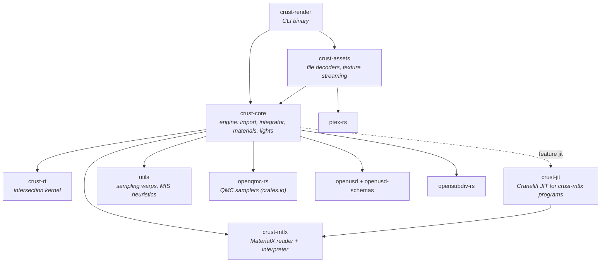

# Architecture

This document is the map: which crate owns what, how a render flows through
them, where the extension seams are, and which invariants cross module
boundaries. It deliberately stays short on *why* a given algorithm was chosen —
that reasoning, with its measurements, lives beside the code, in the
per-capability design records (`openspec/specs/*/design.md`) and in the topic
documents listed at the end. `CLAUDE.md` is the short contributor guide; this is
the page to read first.

## Crates



| crate | owns | knows nothing about |
|-------|------|---------------------|
| `crust-rt` | geometry, SBVH build → BVH4, `intersect` / `occluded`, instancing, motion blur | materials, lights, USD |
| `crust-mtlx` | `.mtlx` parsing, graph → slot-indexed `Program`, the BSDF closure tree and EDF terms, surface-shader nodes expanded into their nodegraphs | crust types (it defines the `Texture` trait it consumes) |
| `crust-jit` | compiling a `Program` to machine code, bit-identical to the interpreter | everything but `crust-mtlx` |
| `crust-core` | USD import, `Scene`, `Renderer`, integrator, materials, lights, volumes, guiding, stats/profile | image, texture and IES decoding; UI |
| `crust-assets` | every file decoder (EXR, PNG/HDR, Ptex, IES, `.tx`), the tile caches, `maketx` | the integrator |
| `crust-render` | argument parsing, logging, progress bar, writing EXR + PNG | decoding anything |
| `utils` | stateless math: warps, `power_heuristic`, `luminance`, `align_to_normal` | everything |

Two properties of this graph are deliberate and worth keeping:

- **`crust-core` decodes no assets.** It parses USD itself (through `openusd`),
  but every byte read from an image, Ptex or IES file crosses the
  `AssetLoader` seam (below) into `crust-assets`. That is why the
  engine library has no codec dependencies and why the probe examples in
  `crust-render/examples/` decode exactly the way the renderer does.
- **The two leaf libraries have no crust dependency.** `crust-rt` and
  `crust-mtlx` are shaped to be extracted the way `openqmc-rs` already was.
  `crust-core` adopts their vocabulary (`crust_rt::Geometry`,
  `crust_mtlx::Texture` re-exported as `Texture2D`) instead of wrapping it in
  adapter traits: a wrapper would add a vtable hop per texel fetch that LTO
  cannot remove.

## A render, end to end

```
crust-render::main
 ├─ FileAssets::new()                        crust-assets: residency policy from CRUST_* env
 ├─ Scene::from_usd_with_options(path, &assets, opts)
 │   └─ scene::usd_import::load_scene        crust-core
 │       ├─ index stage (payloads unloaded) → RenderSettings, camera choice, chunk list
 │       ├─ for each chunk: open masked stage → traverse_into → drop stage
 │       │     prims dispatch to mesh / shapes / instancing / lights / volume / camera
 │       │     materials resolve through materials::resolve_material (cached per stage epoch)
 │       │     assets decode through AssetLoader (timed as "Load assets")
 │       ├─ mesh::flush_meshes               bake-once vs instance, now that counts are final
 │       └─ WorldBuilder::commit             top-level SBVH (crust-rt)
 ├─ Renderer::new(scene)                     light selection table, optional learned light cache
 ├─ Renderer::render_with_stats(tiled, progress)
 │   └─ per tile → per pixel → per sample: render_pixel → trace_path
 │         forward walk: intersect, resolve material (ShadingPoint), NEE, scatter
 │         backward gather: MIS-weighted radiance, guiding training samples
 └─ write EXR (linear) + PNG (tone-mapped) — crust-render only
```

Path guiding (`render_guided`) and adaptive sampling wrap the same per-pixel
routine; a render mode is scheduling only, and tiles vs scanlines are
bit-identical by construction. The adaptive (final) pass runs in rounds (batches
that grow 25% a round, `max(4, taken / 4)`, capped at the budget) over a
full-frame convergence-index buffer, so a pixel stops only
when its cross neighbours are not much less converged than it is
(`crust:adaptiveNeighbourTolerance`, default 1, negative to compare nothing);
a pixel that has seen no light never stops early, and the minimum is floored
at `⌈√spp⌉` — see `openspec/specs/rendering/design.md` § Adaptive sampling.

## Seams

These are the traits and types other code plugs into. Each has a contract that
both sides must keep; the contract lives in the doc comment at the definition.

| seam | defined in | implemented by | contract in one line |
|------|-----------|----------------|----------------------|
| `crust_rt::Geometry`, `SceneBuilder`, `Scene` | `crust-rt/src/scene.rs` | the kernel | Embree-shaped: attach, `commit()`, `intersect` / `occluded`; hits are `(geom_id, prim_id)` only |
| `WorldBuilder` / `World` | `crust-core/src/rt_world.rs` | — | pairs each `geom_id` with its material and per-triangle side tables (Ptex faces, UVs, density) |
| `AssetLoader` | `crust-core/src/scene.rs` | `crust_assets::FileAssets`, `NoAssets` | the host decodes; returning `None` means "fall back", never an error |
| `Texture2D` (= `crust_mtlx::Texture`), `PtexTexture` | `crust-mtlx/src/texture.rs`, `crust-core/src/texture.rs` | `UvTexture`, `StreamingTexture`, `PtexColor`, `PtexStream` | linear values out; unwrapped UVs in (UDIM addressing is the host's) |
| `Material` | `crust-core/src/material/material.rs` | `OpenPBR`, `Emissive`, `MtlxMaterial`, `PreviewSurface` | `resolve` once per vertex → `ShadingPoint`; `eval` returning `None` must not depend on `wi` |
| `Light`, `LightShape` | `crust-core/src/light/` (`mod.rs`, `shape.rs`) | `AreaLight`, `DistantLight`, `DomeLight`; sphere / rect / affine shapes | NEE and the bounce side must compute the same density for the same point |
| `ProgressCallback` | `crust-core/src/tracer/mod.rs` | the CLI's `indicatif` bar | called with `(done, total)`; the engine never prints |
| `RenderStats`, `profile::Section` | `crust-core/src/stats.rs`, `profile.rs` | — | counters always on, timers per phase; `--profile` sections compile away when off |

## `crust-core` module map

| area | modules |
|------|---------|
| scene description | `scene.rs` (`Scene`, `AssetLoader`, `UsdImportOptions`), `camera.rs`, `world.rs` (procedural fallback scene) |
| USD import | `scene/usd_import/` — module map in its `mod.rs`; `scene/subdiv.rs` (OpenSubdiv refinement) |
| geometry bridge | `rt_world.rs` (`World`, side tables), `hittable.rs` (`HitRecord`), `ray.rs` (`Ray`, `RayCone`, ray masks), `aabb.rs` (re-export of the kernel's) |
| integrator | `tracer/` — `mod.rs` (`Renderer`: passes, tiles, guiding schedule), `path.rs` (`trace_path`, NEE, MIS weights, QMC domain keys), `settings.rs` (`RenderSettings`, `SamplingStrategy`); `filter.rs` (pixel filter importance sampling), `buffer.rs` |
| materials | `material/openpbr/` (the übershader: `mod.rs` parameters + `Material` impl, `lobes.rs`, `transmission.rs`), `brdf.rs` (shared lobes), `materialx.rs` (MaterialX `Material` + import), `closure/` (MaterialX closure-tree evaluation, BSDL / MaterialX tables), `preview_surface.rs`, `emissive.rs`, `material.rs` (trait + `ShadingPoint`) |
| lights | `light/` (`shape.rs` and `rect.rs` surfaces, `area.rs`, `infinite.rs` distant + dome, `list.rs` `LightList` and selection), `light_cache.rs` (learned selection), `lux.rs` (UsdLux units, shaping, IES), `environment.rs` (dome map importance sampling) |
| media | `medium.rs` (carried media: glass/subsurface interiors), `volume.rs` (free-standing volume regions), `subsurface.rs` (MaterialX `subsurface_bsdf` random walk: Chiang remap, channel MIS, Dwivedi guiding, the exit Lambertian) |
| guiding | `guiding/` — `sdtree.rs`, `dtree.rs`, `field.rs` (Practical Path Guiding) |
| textures | `texture.rs` (`ColorSpace`, texture refs, `PtexTexture`) |
| reporting | `stats.rs` (`--stats`), `profile.rs` (`--profile`), `error.rs` |

## Invariants that span modules

Most bugs this codebase has had were one half of a pair changing without the
other. The pairs:

- **MIS weights.** Every NEE weight has a bounce-side twin
  (`bounce_emission_weight`, `escaped_emission`), and both go through
  `SamplingStrategy` and `LightList::density` / the `*_at` lookups. Surface
  NEE ↔ BSDF bounce, volume NEE ↔ `PrevVertex::Phase`, guided mixture pdf ↔ NEE.
- **Light radiance.** `Emissive::radiance_toward` is the one answer to "what
  does this light emit toward here", read by `AreaLight::sample_li` and by
  `Material::emitted_at`.
- **Cutouts.** A hit a path passes through (`pass_cutouts`, probability
  `1 − opacity`) and a shadow ray's `Π(1 − opacity)` (`cutout_through`, behind
  `cutout_shadow` and the light cache's training) are one visibility: both ask
  `Material::opacity` point-sampled, both follow at most 256 crossings, both
  are gated on `World::has_cutouts`; change one and NEE and the bounce side
  disagree.
- **Kernel bit-identity.** `Tri4` packets ↔ the scalar triangle test;
  indexed `Tri4i` packets ↔ gathered `Tri4` (`tri4i_matches_tri4_bitwise`,
  `packet_layouts_are_bit_identical`); JIT ↔ interpreter; streamed ↔
  preloaded `u8` textures; tiles ↔ scanlines. Each is pinned by a test that
  compares bits, not tolerances.
- **Derived, not stored.** A hit's tangent (`tangent_of`) and a subdivided
  mesh's Ptex sub-face corners (`SubFace::corners`) are computed from the
  kernel's shared vertices and a 4-byte cell at the hit; the tests that pin
  them against the tables they replaced must keep passing if either formula
  moves.
- **Import cache keys.** Anything keyed on a prototype path is scoped by the
  stage epoch (`ImportCaches::epoch`), because `/__Prototype_N` is renumbered
  per masked stage.
- **Colour spaces.** Every colour input states its space; the per-input
  inventory is `docs/color_management.md`.

## Environment switches

Every switch exists to A/B one optimization against the behaviour it
replaced; with the switch set, the result is either bit-identical or the
documented alternative.

All of them are parsed once, in `crust-core/src/config.rs`, into the typed
`Config` that `crust_core::config()` returns (the "owner" column is the code
that obeys the field). Booleans share one grammar: `0`/`false`/`off`/`no` is
off, `1`/`true`/`on`/`yes` is on, and anything else warns once and keeps the
default. (Before the typed layer only the exact string `0` turned a default-on
switch off, and only `1` turned `CRUST_PTEX_STREAM` on; the other spellings
are the one behaviour change.) Numbers are validated by their type and warn
once on a bad value — `CRUST_TEX_MAX` used to fall back silently. A test or
probe that needs another setting builds a `Config` and passes it
(`FileAssets::with_config`) instead of mutating the environment.

| variable | default | owner | effect |
|----------|---------|-------|--------|
| `CRUST_STREAM_IMPORT` | on | `usd_import/mod.rs` | `0`: import under one stage instead of one masked stage per subtree |
| `CRUST_MESH_BAKE` | on | `usd_import/mesh.rs` | `0`: instance every mesh instead of baking single placements (not bit-identical: an instanced mesh is intersected in local space, so ~0.2% of cornellbox's pixels differ in the last ulp at 16 spp, relmse 4e-18) |
| `CRUST_SUBDIV` | on | `usd_import/attrs.rs` | `0`: render every mesh as its faceted cage (unlike `--subdiv-level 0`, no smooth cage normals) |
| `CRUST_ADAPTIVE_PER_FACE` | on | `usd_import/mesh.rs` (`mesh_source`) | In adaptive subdivision only. `0`: refine each unshared subdivision mesh to one level instead of tessellating it per face at its edges' own rates |
| `CRUST_ADAPTIVE_FRUSTUM` | on | `usd_import/adaptive.rs` (`Frustum`) | In adaptive subdivision only. `0`: rate geometry outside the camera's view by distance like the rest, instead of splitting each of its edges once |
| `CRUST_BVH_PACKET_SAH` | on | `lib.rs` (`commit_options`) → every kernel `commit` | `0`: the per-triangle SAH leaf cost before packet-sized leaves (five to eight overlapping triangles split into two half-empty packets). Not bit-identical: the trees differ in shape, so exact-tie hits can differ; proven noise by the 1/√N check in the design record |
| `CRUST_TRI_PACKETS` | `auto` (= `gathered`) | `lib.rs` (`packet_layout`) → every kernel `commit` | `gathered`: 192-byte vertex-carrying packets (the layout before indexed packets); `indexed`: 92-byte index packets, a quarter fewer kernel bytes per triangle for 13–30% slower traversal (8–9% on the Moana island at level 1, where a 3–4% faster import makes the whole run faster) — the opt-in for a scene that otherwise does not fit. Bit-identical |
| `CRUST_MTLX_OPT` | on | `material/materialx.rs` | `0`: skip constant folding / hoisting / pruning (bit-identical) |
| `CRUST_SHADER_JIT` | on | `material/materialx.rs` | `0`: interpret MaterialX programs instead of JIT (bit-identical) |
| `CRUST_RAY_CONES` | on | `tracer/path.rs` | `0`: zero every texture footprint (finest mip always) |
| `CRUST_TEX` | on | `crust-assets/lib.rs` | `0`: decline every UV texture (surfaces use constants) |
| `CRUST_TEX_MAX` | 1024 | `crust-assets/uv_texture/` | preloaded tile edge cap, pixels |
| `CRUST_TEX_MIP` | on | `crust-assets/uv_texture/` | `0`: no mip pyramid on UV textures |
| `CRUST_TEX_STREAM` | on | `crust-assets/lib.rs` | `0`: preload even when a `.tx` exists |
| `CRUST_TEX_CACHE_MB` | 1024 | `crust-assets/tiled/cache.rs` | `.tx` tile cache budget |
| `CRUST_PTEX` | on | `crust-assets/lib.rs` | `0`: decline every Ptex texture |
| `CRUST_PTEX_MAX_LOG2` | 5 (preload) / uncapped (stream) | `crust-assets/ptex_texture.rs` | per-face resolution cap, log2 edge |
| `CRUST_PTEX_MIP` | on | `crust-assets/ptex_texture.rs` | `0`: no per-face mip pyramid |
| `CRUST_PTEX_STREAM` | off | `crust-assets/ptex_stream.rs` | `1`: page Ptex tiles through the reader's cache |
| `CRUST_PTEX_CACHE_MB` | 1024 | `crust-assets/ptex_stream.rs` | Ptex streaming budget, shared by all streamed files |
| `CRUST_PTEX_STREAM_MIN_MB` | 8 | `crust-assets/ptex_stream.rs` | files smaller than this preload even when streaming |
| `CRUST_PTEX_STREAM_MIPSPACE` | `linear` | `crust-assets/ptex_stream.rs` | `file`: accept the file's own mip chain (otherwise a mipmapped `.ptx` preloads) |

Adding a switch: give it a field on `Config`, a line here and a section in the user
documentation (`site/content/docs/reference/environment-variables.md`), and make the
"off" side the behaviour it replaced so the switch is an honest A/B.

## Tests and verification

| what | where |
|------|-------|
| kernel exactness (bitwise, every SIMD codegen) | `crust-rt/tests/kernel.rs`, `scripts/test_simd_matrix.sh` |
| MaterialX parsing, evaluation, optimization | `crust-mtlx/tests/`; JIT ↔ interpreter in `crust-jit/tests/jit.rs` |
| MaterialX node semantics against the reference implementation | `crust-mtlx/tests/osl_oracle.rs` (committed OSL values; `scripts/osl_oracle.py` regenerates them) |
| USD import against the checked-in samples | `crust-core/tests/usd_scene.rs`; inline stages in `usd_inline.rs` |
| lights, materials, volumes, guiding, stats, profile | the matching file in `crust-core/tests/` |
| decoders, `.tx` streaming, Ptex streaming | `crust-assets/tests/` |
| "did the image change?" | `scripts/check_images.sh record|check` (16 spp, see `CLAUDE.md` § Measuring a change) |
| "is it faster?" | `scripts/bench_ab.sh` (interleaved A/B), callgrind for sub-5% changes |

CI (`.github/workflows/rust.yml`, toolchain pinned) runs `cargo fmt --check`,
`cargo clippy --workspace --all-targets -D warnings` and
`cargo test --workspace`.

## Technical debt register

Paid down in the 2026-09-27 architecture pass (no rendered output changed):

- `scene/usd_import.rs` (5 847 lines) split along its section banners into
  `scene/usd_import/` — twelve submodules with explicit imports, so each
  file's dependencies are listed at its top. The traversal and the import-wide
  state stay in `mod.rs`.
- Dead code removed: the unused `random_scene`, the `rand`-backed helpers in
  `utils` (and with them the `rand` dependency), `utils::clamp`, and two dead
  helpers in `openpbr`; test-only helpers moved under `#[cfg(test)]`.
- Unused `serde` dependency and glam's `serde` feature removed.
- Three copies of Rec.709 luminance merged into `utils::luminance`; the CLI's
  sRGB encoder now calls `crust_assets::linear_to_srgb`.
- Stale comments corrected (`unsafe_code` policy, the opensubdiv dependency, a
  doc comment that had drifted onto the wrong function), and line-number
  references in `docs/color_management.md` replaced by function names.
- The next five largest files split the same way, each into a module
  directory with its tests in their own file and every public path kept by
  re-export: `material/openpbr/` (lobes, transmission), `tracer/` (settings,
  path), `light/` (shape, rect, area, infinite, list), `crust-rt`'s `bvh/`
  (build, collapse, stats) and `crust-assets`'s `uv_texture/` (tile, udim,
  decode, mip). Verified codegen-neutral, not just output-neutral: under
  callgrind every hot function (`Bvh::hit`, `render_pixel`,
  `scatter_resolved`, `eval_all`, `pdf_all`) executes the same instruction
  count to the unit on cornellbox and materialx_basic.
- `CLAUDE.md` cut from 2 400 lines to a short contributor guide; the
  per-feature design records, measurements and known gaps moved verbatim into
  `openspec/specs/<capability>/design.md` (three new capabilities:
  `intersection-kernel`, `lighting`, `textures`).

Paid down since, from `docs/rust_leverage.md`: environment parsing is one
typed `Config` (`crust-core/src/config.rs`) instead of nineteen hand-rolled
reads, some cached and some re-read per prim or texture open.

Paid down by `compact-triangle-storage` (2026-10-01): the kernel stored every
triangle three times (an 80-byte primitive node with its own vertex copy, the
SIMD packet, and three unshared per-corner normals) and the importer kept
per-corner UV, tangent and Ptex-corner tables beside it. Triangles are now
24-byte records over shared vertex and per-vertex normal tables, the build's
references and nodes are unpadded, leaf tables are sized exactly, subtrees
merge in place, leaves are sized by packet rounds, tangents and Ptex sub-face
corners are derived at the hit. The subdivision stress grid went from 196 to
96 kernel bytes per triangle and from 809 to 508 MiB peak RSS, bit-identical
(up to exact-tie hits under the packet leaf rule).

Still open, roughly in order of payoff:

1. **`hittable.rs` and `aabb.rs` are vestigial names.** There is no `Hittable`
   trait any more (the file holds `HitRecord`), and `aabb.rs` only re-exports
   the kernel's type.
2. **Test files over 1 500 lines** (`usd_scene.rs`, `usd_inline.rs`,
   `crust-mtlx/tests/graph.rs`) would split naturally by schema family, the
   way the importer now does. The largest source files left are
   `stats.rs` (1 360), `materialx.rs` (1 430) and `usd_import/mesh.rs`
   (1 410); none is urgent.
3. **Hot-path splits need a callgrind, not an eye.** Any further move inside
   `tracer/path.rs` or `bvh/mod.rs` should repeat the per-function
   instruction comparison above: the integrator is monomorphised on
   `PROFILE` and some helpers are `inline(always)` for measured reasons
   (`profile.rs`). `compact-triangle-storage` found the inverse trap too:
   shrinking `PrimNode` let LLVM inline the scalar dispatch into `Bvh::hit`
   and spill its loop; `PrimNode::hit` is `inline(never)` for that reason.
4. **The SBVH build still materialises the binary tree.** References and
   nodes are 28 and 32 bytes and subtrees merge in place, but the commit's
   peak is still the binary tree plus the collapsed one; a builder that
   emits wide nodes directly (fused collapsing) is the remaining lever, and
   the composed USD stage, not the kernel, is most of a production scene's
   peak.

## Further reading

| topic | document |
|-------|----------|
| contributor rules, commands, measuring a change | `CLAUDE.md` |
| every feature in depth, with measurements, history and known gaps | `openspec/specs/*/design.md` |
| light sampling survey, roadmap and baselines | `docs/light_sampling.md` |
| shading cost and the MaterialX JIT plan | `docs/shading_performance.md` |
| the subsurface random walk: cost breakdown, measured variants, roadmap | `docs/subsurface_walk.md` |
| colour space of every input | `docs/color_management.md` |
| Ptex streaming design and figures | `docs/ptex_streaming.md` |
| SIMD audit | `docs/simd.md` |
| Rust idioms audit: dispatch, type-level invariants, zero-cost, ownership | `docs/rust_leverage.md` |
| kernel vs Embree | `docs/embree_comparison.md` |
| OpenPBR formula alignment | `docs/openpbr_reference_alignment.md` |
| MaterialX Material Fidelity suite: harness and baseline | `docs/material_fidelity.md` |
| ALab render profile | `docs/alab_profile.md` |
| Moana island render profile | `docs/moana_profile.md` |
| upstream openusd bugs (fixed) | `docs/issues/` |
| behavioural specs | `openspec/specs/` |
