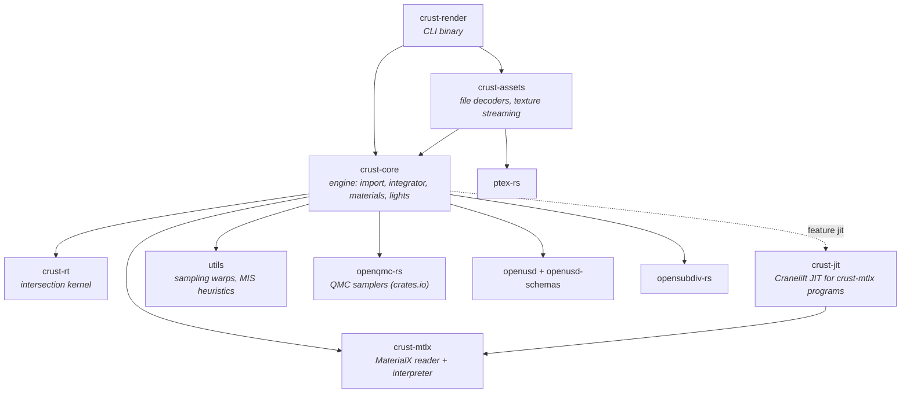

# Architecture

This document is the map: which crate owns what, how a render flows through
them, where the extension seams are, and which invariants cross module
boundaries. It deliberately stays short on *why* a given algorithm was chosen —
that reasoning, with its measurements, lives beside the code and in the
topic documents listed at the end. `CLAUDE.md` is the long-form, per-feature
record; this is the page to read first.

## Crates



| crate | owns | knows nothing about |
|-------|------|---------------------|
| `crust-rt` | geometry, SBVH build → BVH4, `intersect` / `occluded`, instancing, motion blur | materials, lights, USD |
| `crust-mtlx` | `.mtlx` parsing, graph → slot-indexed `Program`, BSDF/EDF flattening to weighted lobes | crust types (it defines the `Texture` trait it consumes) |
| `crust-jit` | compiling a `Program` to machine code, bit-identical to the interpreter | everything but `crust-mtlx` |
| `crust-core` | USD import, `Scene`, `Renderer`, integrator, materials, lights, volumes, guiding, stats/profile | file formats, image codecs, UI |
| `crust-assets` | every file decoder (EXR, PNG/HDR, Ptex, IES, `.tx`), the tile caches, `maketx` | the integrator |
| `crust-render` | argument parsing, logging, progress bar, writing EXR + PNG | decoding anything |
| `utils` | stateless math: warps, `power_heuristic`, `luminance`, `align_to_normal` | everything |

Two properties of this graph are deliberate and worth keeping:

- **`crust-core` decodes nothing.** Every byte read from an image or Ptex file
  crosses the `AssetLoader` seam (below) into `crust-assets`. That is why the
  engine library has no codec dependencies and why the probe examples in
  `crust-render/examples/` decode exactly the way the renderer does.
- **The two leaf libraries have no crust dependency.** `crust-rt` and
  `crust-mtlx` are shaped to be extracted the way `openqmc-rs` already was.
  `crust-core` adopts their vocabulary (`crust_rt::Geometry`,
  `crust_mtlx::Texture` re-exported as `Texture2D`) instead of wrapping it in
  adapter traits: a wrapper would add a vtable hop per texel fetch that LTO
  cannot remove.

## A render, end to end

```
crust-render::main
 ├─ FileAssets::new()                        crust-assets: residency policy from CRUST_* env
 ├─ Scene::from_usd_with_options(path, &assets, opts)
 │   └─ scene::usd_import::load_scene        crust-core
 │       ├─ index stage (payloads unloaded) → RenderSettings, camera choice, chunk list
 │       ├─ for each chunk: open masked stage → traverse_into → drop stage
 │       │     prims dispatch to mesh / shapes / instancing / lights / volume / camera
 │       │     materials resolve through materials::resolve_material (cached per stage epoch)
 │       │     assets decode through AssetLoader (timed as "Load assets")
 │       ├─ mesh::flush_meshes               bake-once vs instance, now that counts are final
 │       └─ WorldBuilder::commit             top-level SBVH (crust-rt)
 ├─ Renderer::new(scene)                     light selection table, optional learned light cache
 ├─ Renderer::render_with_stats(tiled, progress)
 │   └─ per tile → per pixel → per sample: render_pixel → trace_path
 │         forward walk: intersect, resolve material (ShadingPoint), NEE, scatter
 │         backward gather: MIS-weighted radiance, guiding training samples
 └─ write EXR (linear) + PNG (tone-mapped) — crust-render only
```

Path guiding (`render_guided`) and adaptive sampling wrap the same per-pixel
routine; a render mode is scheduling only, and tiles vs scanlines are
bit-identical by construction.

## Seams

These are the traits and types other code plugs into. Each has a contract that
both sides must keep; the contract lives in the doc comment at the definition.

| seam | defined in | implemented by | contract in one line |
|------|-----------|----------------|----------------------|
| `crust_rt::Geometry`, `SceneBuilder`, `Scene` | `crust-rt/src/scene.rs` | the kernel | Embree-shaped: attach, `commit()`, `intersect` / `occluded`; hits are `(geom_id, prim_id)` only |
| `WorldBuilder` / `World` | `crust-core/src/rt_world.rs` | — | pairs each `geom_id` with its material and per-triangle side tables (Ptex faces, UVs, density) |
| `AssetLoader` | `crust-core/src/scene.rs` | `crust_assets::FileAssets`, `NoAssets` | the host decodes; returning `None` means "fall back", never an error |
| `Texture2D` (= `crust_mtlx::Texture`), `PtexTexture` | `crust-mtlx/src/texture.rs`, `crust-core/src/texture.rs` | `UvTexture`, `StreamingTexture`, `PtexColor`, `PtexStream` | linear values out; unwrapped UVs in (UDIM addressing is the host's) |
| `Material` | `crust-core/src/material/material.rs` | `OpenPBR`, `Emissive`, `MtlxMaterial`, `PreviewSurface` | `resolve` once per vertex → `ShadingPoint`; `eval` returning `None` must not depend on `wi` |
| `Light`, `LightShape` | `crust-core/src/light.rs` | `AreaLight`, `DistantLight`, `DomeLight`; sphere / rect / affine shapes | NEE and the bounce side must compute the same density for the same point |
| `ProgressCallback` | `crust-core/src/tracer.rs` | the CLI's `indicatif` bar | called with `(done, total)`; the engine never prints |
| `RenderStats`, `profile::Section` | `crust-core/src/stats.rs`, `profile.rs` | — | counters always on, timers per phase; `--profile` sections compile away when off |

## `crust-core` module map

| area | modules |
|------|---------|
| scene description | `scene.rs` (`Scene`, `AssetLoader`, `UsdImportOptions`), `camera.rs`, `world.rs` (procedural fallback scene) |
| USD import | `scene/usd_import/` — module map in its `mod.rs`; `scene/subdiv.rs` (OpenSubdiv refinement) |
| geometry bridge | `rt_world.rs` (`World`, side tables), `hittable.rs` (`HitRecord`), `ray.rs` (`Ray`, `RayCone`, ray masks), `aabb.rs` (re-export of the kernel's) |
| integrator | `tracer.rs` (`Renderer`, `RenderSettings`, `trace_path`, MIS strategies), `filter.rs` (pixel filter importance sampling), `buffer.rs` |
| materials | `material/openpbr.rs` (the übershader), `brdf.rs` (shared lobes), `materialx.rs` (MaterialX adapter), `preview_surface.rs`, `emissive.rs`, `material.rs` (trait + `ShadingPoint`) |
| lights | `light.rs` (shapes, lights, `LightList` and selection), `light_cache.rs` (learned selection), `lux.rs` (UsdLux units, shaping, IES), `environment.rs` (dome map importance sampling) |
| media | `medium.rs` (carried media: glass/subsurface interiors), `volume.rs` (free-standing volume regions) |
| guiding | `guiding/` — `sdtree.rs`, `dtree.rs`, `field.rs` (Practical Path Guiding) |
| textures | `texture.rs` (`ColorSpace`, texture refs, `PtexTexture`) |
| reporting | `stats.rs` (`--stats`), `profile.rs` (`--profile`), `error.rs` |

## Invariants that span modules

Most bugs this codebase has had were one half of a pair changing without the
other. The pairs:

- **MIS weights.** Every NEE weight has a bounce-side twin
  (`bounce_emission_weight`, `escaped_emission`), and both go through
  `SamplingStrategy` and `LightList::density` / the `*_at` lookups. Surface
  NEE ↔ BSDF bounce, volume NEE ↔ `PrevVertex::Phase`, guided mixture pdf ↔ NEE.
- **Light radiance.** `Emissive::radiance_toward` is the one answer to "what
  does this light emit toward here", read by `AreaLight::sample_li` and by
  `Material::emitted_at`.
- **Kernel bit-identity.** `Tri4` packets ↔ the scalar triangle test;
  JIT ↔ interpreter; streamed ↔ preloaded `u8` textures; tiles ↔ scanlines.
  Each is pinned by a test that compares bits, not tolerances.
- **Import cache keys.** Anything keyed on a prototype path is scoped by the
  stage epoch (`ImportCaches::epoch`), because `/__Prototype_N` is renumbered
  per masked stage.
- **Colour spaces.** Every colour input states its space; the per-input
  inventory is `docs/color_management.md`.

## Environment switches

Every switch exists to A/B one optimization against the behaviour it
replaced; with the switch set, the result is either bit-identical or the
documented alternative. Booleans read `=0` as "off" unless noted.

| variable | default | owner | effect |
|----------|---------|-------|--------|
| `CRUST_STREAM_IMPORT` | on | `usd_import/mod.rs` | `0`: import under one stage instead of one masked stage per subtree |
| `CRUST_MESH_BAKE` | on | `usd_import/mesh.rs` | `0`: instance every mesh instead of baking single placements (bit-identical) |
| `CRUST_SUBDIV` | on | `usd_import/attrs.rs` | `0`: render every subdivision cage unrefined |
| `CRUST_MTLX_OPT` | on | `material/materialx.rs` | `0`: skip constant folding / hoisting / pruning (bit-identical) |
| `CRUST_SHADER_JIT` | on | `material/materialx.rs` | `0`: interpret MaterialX programs instead of JIT (bit-identical) |
| `CRUST_RAY_CONES` | on | `tracer.rs` | `0`: zero every texture footprint (finest mip always) |
| `CRUST_TEX` | on | `crust-assets/lib.rs` | `0`: decline every UV texture (surfaces use constants) |
| `CRUST_TEX_MAX` | 1024 | `crust-assets/uv_texture.rs` | preloaded tile edge cap, pixels |
| `CRUST_TEX_MIP` | on | `crust-assets/uv_texture.rs` | `0`: no mip pyramid on UV textures |
| `CRUST_TEX_STREAM` | on | `crust-assets/lib.rs` | `0`: preload even when a `.tx` exists |
| `CRUST_TEX_CACHE_MB` | 1024 | `crust-assets/tiled/cache.rs` | `.tx` tile cache budget |
| `CRUST_PTEX` | on | `crust-assets/lib.rs` | `0`: decline every Ptex texture |
| `CRUST_PTEX_MAX_LOG2` | 5 (preload) / uncapped (stream) | `crust-assets/ptex_texture.rs` | per-face resolution cap, log2 edge |
| `CRUST_PTEX_MIP` | on | `crust-assets/ptex_texture.rs` | `0`: no per-face mip pyramid |
| `CRUST_PTEX_STREAM` | off | `crust-assets/ptex_stream.rs` | `1`: page Ptex tiles through the reader's cache |
| `CRUST_PTEX_CACHE_MB` | 1024 | `crust-assets/ptex_stream.rs` | Ptex streaming budget, shared by all streamed files |
| `CRUST_PTEX_STREAM_MIN_MB` | 8 | `crust-assets/ptex_stream.rs` | files smaller than this preload even when streaming |
| `CRUST_PTEX_STREAM_MIPSPACE` | `linear` | `crust-assets/ptex_stream.rs` | `file`: accept the file's own mip chain (otherwise a mipmapped `.ptx` preloads) |

Adding a switch: give it a line here and in `CLAUDE.md`, parse it next to the
code it controls, and make the "off" side the behaviour it replaced so the
switch is an honest A/B.

## Tests and verification

| what | where |
|------|-------|
| kernel exactness (bitwise, every SIMD codegen) | `crust-rt/tests/kernel.rs`, `scripts/test_simd_matrix.sh` |
| MaterialX parsing, evaluation, optimization | `crust-mtlx/tests/`; JIT ↔ interpreter in `crust-jit/tests/jit.rs` |
| USD import against the checked-in samples | `crust-core/tests/usd_scene.rs`; inline stages in `usd_inline.rs` |
| lights, materials, volumes, guiding, stats, profile | the matching file in `crust-core/tests/` |
| decoders, `.tx` streaming, Ptex streaming | `crust-assets/tests/` |
| "did the image change?" | `scripts/check_images.sh record|check` (16 spp, see `CLAUDE.md` § Measuring a change) |
| "is it faster?" | `scripts/bench_ab.sh` (interleaved A/B), callgrind for sub-5% changes |

CI (`.github/workflows/rust.yml`, toolchain pinned) runs `cargo fmt --check`,
`cargo clippy --workspace --all-targets -D warnings` and
`cargo test --workspace`.

## Technical debt register

Paid down in the 2026-09-27 architecture pass (no rendered output changed):

- `scene/usd_import.rs` (5 847 lines) split along its section banners into
  `scene/usd_import/` — twelve submodules with explicit imports, so each
  file's dependencies are listed at its top. The traversal and the import-wide
  state stay in `mod.rs`.
- Dead code removed: the unused `random_scene`, the `rand`-backed helpers in
  `utils` (and with them the `rand` dependency), `utils::clamp`, and two dead
  helpers in `openpbr.rs`; test-only helpers moved under `#[cfg(test)]`.
- Unused `serde` dependency and glam's `serde` feature removed.
- Three copies of Rec.709 luminance merged into `utils::luminance`; the CLI's
  sRGB encoder now calls `crust_assets::linear_to_srgb`.
- Stale comments corrected (`unsafe_code` policy, the opensubdiv dependency, a
  doc comment that had drifted onto the wrong function), and line-number
  references in `docs/color_management.md` replaced by function names.

Still open, roughly in order of payoff:

1. **Large files with clean seams.** `material/openpbr.rs` (2 700 lines, half
   of it tests), `tracer.rs` (2 200: `Renderer`, `RenderSettings` and the path
   integrator are separable), `light.rs` (1 800: shapes / lights / `LightList`),
   `crust-rt/src/bvh.rs` (1 850: build vs traversal) and
   `crust-assets/src/uv_texture.rs` (1 500). The integrator is
   inlining-sensitive (see `profile.rs`'s monomorphisation notes), so split it
   with a callgrind before/after, not by eye.
2. **`CLAUDE.md` is 2 400 lines.** It is accurate and full of hard-won
   measurements, but it mixes a contributor guide, a changelog and design
   records. Moving the per-feature histories into `docs/` topic files and
   leaving `CLAUDE.md` as rules + pointers would make it usable again.
3. **Environment parsing is hand-rolled per variable.** The convention is
   consistent (`=0` off), but budget parsing warns on bad input in some places
   and not others (`CRUST_TEX_MAX` is silent), and crust-core caches its flags
   in `OnceLock`s while crust-assets re-reads per call.
4. **`hittable.rs` and `aabb.rs` are vestigial names.** There is no `Hittable`
   trait any more (the file holds `HitRecord`), and `aabb.rs` only re-exports
   the kernel's type.
5. **Test files over 1 500 lines** (`usd_scene.rs`, `usd_inline.rs`,
   `crust-mtlx/tests/graph.rs`) would split naturally by schema family, the
   way the importer now does.

## Further reading

| topic | document |
|-------|----------|
| every feature in depth, with measurements and history | `CLAUDE.md` |
| light sampling survey, roadmap and baselines | `docs/light_sampling.md` |
| shading cost and the MaterialX JIT plan | `docs/shading_performance.md` |
| colour space of every input | `docs/color_management.md` |
| Ptex streaming design and figures | `docs/ptex_streaming.md` |
| SIMD audit | `docs/simd.md` |
| kernel vs Embree | `docs/embree_comparison.md` |
| OpenPBR formula alignment | `docs/openpbr_reference_alignment.md` |
| ALab render profile | `docs/alab_profile.md` |
| upstream openusd bugs (fixed) | `docs/issues/` |
| behavioural specs | `openspec/specs/` |
