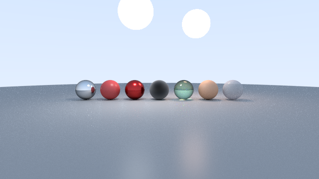

+++
title = "Introduction"
description = "Crust Render is a physically-based path tracer that renders USD scenes."
date = 2026-10-01T08:00:00+00:00
updated = 2026-10-01T08:00:00+00:00
draft = false
weight = 10
sort_by = "weight"
template = "docs/page.html"

[extra]
lead = 'Crust Render is a physically-based path tracer written in safe Rust. It reads <b>USD</b> scenes and writes a linear EXR plus a tone-mapped PNG.'
toc = true
top = false
+++

## What it is

Crust Render is a toy path tracer, informed by PBRT, *Ray Tracing in One Weekend* and
Autodesk Standard Surface / OpenPBR. It is a single-author project, not a production
renderer. It still loads production-scale USD assets such as Disney Animation's Moana
Island and ALab.

The full scene comes from the USD stage: camera, geometry, lights, materials and render
settings. Crust reads standard USD schemas (`UsdGeom`, `UsdLux`, `UsdShade`,
`UsdRender`) and adds its own settings as `crust:*` custom attributes.

## How a render is configured

A render takes its settings from three places. When two of them set the same thing, the
one higher in this list wins:

1. **Command-line flags**, such as `--samples` or `--filter`. They override the scene for
   one render. See [Command line](@/docs/reference/command-line.md).
2. **USD attributes** on the stage, such as `crust:samplesPerPixel` on the
   `RenderSettings` prim. They travel with the scene. See
   [USD attributes](@/docs/usd/overview.md).
3. **Built-in defaults**, used when nothing else sets a value.

**Environment variables** (`CRUST_*`) are a separate thing. They don't change what the
scene looks like. Each one switches an optimization off, or tunes a memory budget, so you
can compare against the old behaviour. See
[Environment variables](@/docs/reference/environment-variables.md).

## Output

Each render writes two images:

- a **linear EXR** at the `-o` path (default `output.exr`), and
- a **tone-mapped sRGB PNG** beside it, at the same path with a `.png` extension.

## Next steps

- [Quick Start →](@/docs/getting-started/quick-start.md) Build Crust Render and render a
  bundled sample.
- [Command line →](@/docs/reference/command-line.md) Every flag.
- [Environment variables →](@/docs/reference/environment-variables.md) Every `CRUST_*`
  switch.
- [USD attributes →](@/docs/usd/overview.md) Every `crust:*` attribute.
- [Architecture →](@/docs/architecture/overview.md) How Crust Render is built, and why.
- [FAQ →](@/docs/help/faq.md) Common problems.
